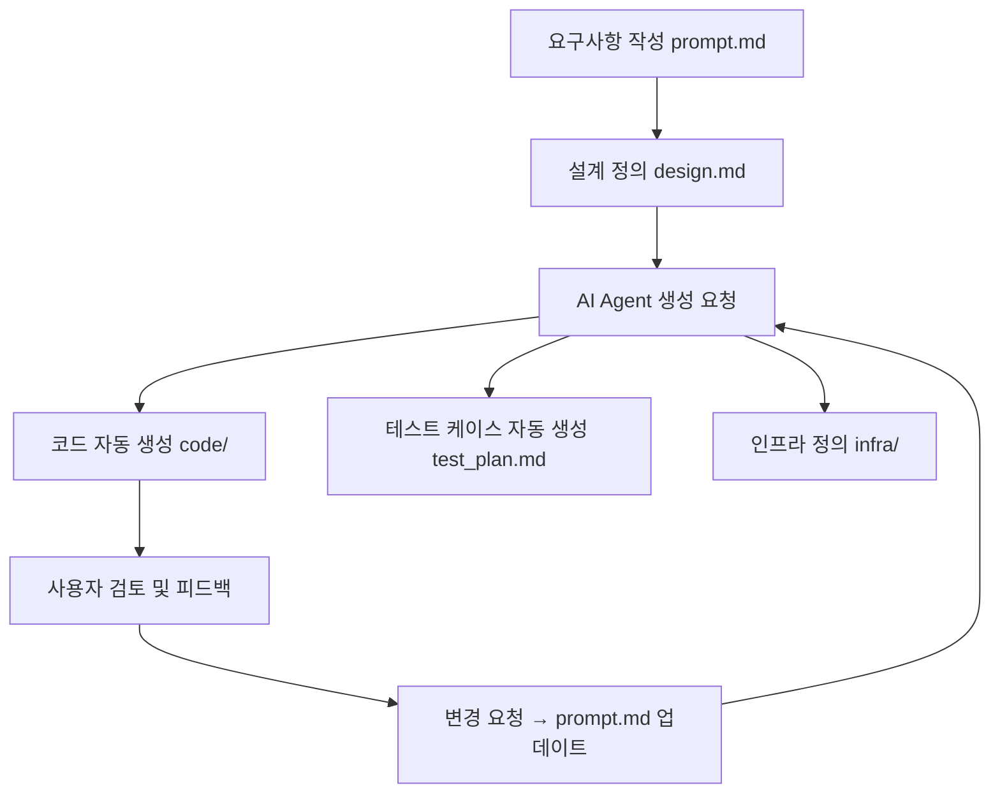

# Code as a Document (CaD)

## 개요

**Code as a Document (CaD)**는 소프트웨어 개발을 문서 기반으로 재구성하는 새로운 개발 패러다임이다. 이 개념은 AI 에이전트와 협업하여 요구사항 정의부터 코드 생성, 테스트, 인프라 구성까지 모든 개발 단계를 Plain Text 문서로 표현하고 제어하는 것을 핵심 원칙으로 한다.
CaD는 전통적인 IDE 기반 코드 중심 개발을 넘어서, 개발 전체를 하나의 문서 흐름(Doc Flow)으로 통합함으로써 AI 친화적, 형상관리 친화적, 자동화 중심 개발 환경을 가능하게 한다.

## 핵심 아이디어

모든 개발 산출물을 텍스트 기반 문서로 표현한다.
요구사항, 설계, 다이어그램, 테스트 계획, 인프라 정의, 코드 모두를 동일한 문서 체계 내에서 관리한다.
AI 에이전트는 문서를 분석하고, 변경 사항을 반영하며, 필요한 코드를 생성 및 업데이트한다.

## 구성 요소

| 구성 요소             | 설명                                         |
| ----------------- | ------------------------------------------ |
| `prompt.md`       | 사용자 또는 PM이 작성한 고레벨 요구사항 설명                 |
| `design.md`       | 시스템 아키텍처 및 설계, 다이어그램 포함 (Mermaid/PlantUML) |
| `spec.md`         | 컴포넌트별 기능 명세 및 제약 조건                        |
| `code/` 디렉터리      | AI가 생성한 실제 소스 코드 파일                        |
| `infra/` 디렉터리     | Terraform, Ansible, Docker 등 인프라 정의        |
| `test_plan.md`    | 테스트 시나리오, 경계 조건 등 테스트 요구 정의                |
| `agent_prompt.md` | AI 에이전트 명령 히스토리 및 MCP 포맷                   |
| `change_log.md`   | 요구사항 변경 이력 및 자동 반영 내역                      |

## Cad 개발 흐름

## 장점

| 항목              | 설명                         |
| --------------- | -------------------------- |
| **AI 친화적**      | AI가 이해하고 작동하기 쉬운 문서 구조     |
| **Git 형상관리 용이** | 전체 개발 흐름이 문서화되어 변경 추적 용이   |
| **재현 가능성**      | 문서만 있으면 동일한 시스템을 재구성 가능    |
| **자동화 최적화**     | 모든 변경은 문서로 트리거되므로 자동화에 이상적 |
| **비개발자 협업 용이**  | 기획자, 디자이너도 문서를 통해 쉽게 참여 가능 |

## AI Agent와의 인터페이스

AI Agent는 다음 인터페이스를 사용하여 문서를 기반으로 작업을 수행한다:

* mcp://spec-analysis?document=spec.md
* mcp://generate-code?target=main.py
* mcp://update-diagram?source=design.md
* mcp://test-plan-review?document=test_plan.md
* 모든 명령은 Model Context Protocol(MCP) 형태의 URL 스키마로 정의 가능

## 관련 기술 스택

| 분야    | 도구                           |
| ----- | ---------------------------- |
| 코드 생성 | GPT, Code Llama, StarCoder 등 |
| 문서 포맷 | Markdown, YAML, JSON         |
| 다이어그램 | Mermaid, PlantUML            |
| IaC   | Terraform, Pulumi, Ansible   |
| 형상관리  | Git, GitHub Actions          |
| 인터페이스 | CLI, REST API, ChatOps       |

## 향후 확장

CaD 전용 문서 포맷 (.cadoc) 표준화
IDE-less 개발 환경: 단순 텍스트 에디터와 LLM만으로 개발 전환
LLM 기반 PR 리뷰 시스템: 문서 기반 코드 리뷰 자동화
문서 기반 테스트 주도 개발 (Doc-Driven TDD)

## 결론

**Code as a Document (CaD)**는 기존 소프트웨어 개발 방식에서 텍스트 문서 중심 개발로의 패러다임 전환을 제안한다. AI 중심 시대에서 가장 효율적인 개발 환경은 코드가 아닌 문서에서 출발할 수 있으며, 이는 사람과 AI가 협업하기 위한 최적의 구조가 될 수 있다.
