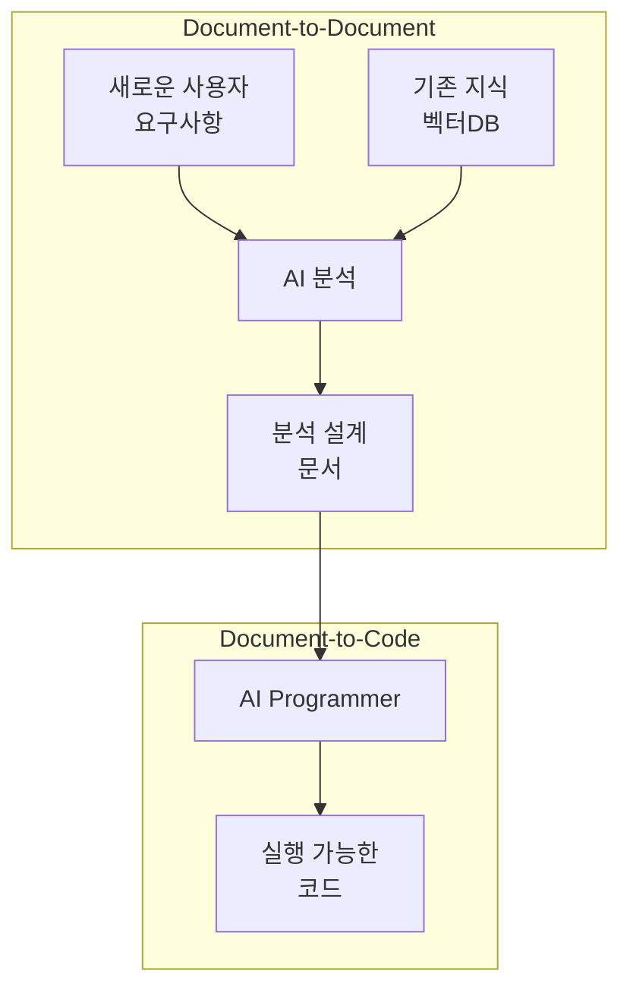

# AI Native Development

Code as a Document(CaD)는 사람과 AI가 함께하는 Markdown 기반 개발 방식이다.

최근 개발 방식의 경향은 [AI 개발 보고서](ai_development_report.md)를 참고하자.

## 핵심 개념

### Markdown: 사람과 AI의 공통 언어

Plain Text는 사람과 AI가 동시에 이해하기 쉬운 유일한 형식입니다. 그 중에서도 **Markdown**은 구조화된 Plain Text의 대표적 예시로, 사람이 읽기 쉽고 AI가 파싱하기 쉬운 최적의 형식입니다. 이 프레임워크에서 "Document"는 모두 **Markdown 문서**를 의미합니다.

### 두 단계 개발 파이프라인

이 프레임워크는 **Document-to-Document**와 **Document-to-Code** 두 단계로 구성된 AI 기반 개발 환경입니다.

## 두 단계 프로세스

### 1단계: Document-to-Document (분석 설계)
**기존 지식 → 새로운 설계 문서**

- 기존 요구사항/설계 문서를 벡터 DB에 저장
- AI가 기존 지식을 검색하고 분석
- 새로운 요구사항에 맞는 설계 문서 자동 생성
- Markdown + Mermaid 형식으로 표준화

### 2단계: Document-to-Code (문서 기반 코드 생성)
**설계 문서 → 실행 가능한 코드**

- Code as a Document (CaD) 패러다임 적용
- 설계 문서를 기반으로 AI Agent가 코드 생성
- 테스트, 인프라 코드까지 자동 생성
- 문서 변경 시 자동으로 코드 업데이트

## 핵심 가치

### 🔄 연속적 지식 활용
기존 프로젝트의 지식이 새로운 프로젝트의 출발점이 됩니다.

### 🤖 AI Agent 친화적
모든 과정이 텍스트 문서로 표현되어 AI가 이해하고 처리하기 최적화되었습니다.

### 📝 문서 중심 개발
코드가 아닌 문서에서 시작하여 개발자와 AI가 자연스럽게 협업합니다.

### ⚡ 완전 자동화
문서 작성만으로 전체 개발 프로세스가 자동으로 진행됩니다.

## 시스템 구성

### AI 기반 지식 관리 시스템
- 벡터 DB 기반 문서 검색
- MCP 프로토콜 인터페이스
- 의미 기반 문서 조회

### CaD 개발 환경
- `requirements.md` → `design.md` → `code/` → `test_plan.md`
- AI Agent 명령 인터페이스
- Git 기반 형상관리

## 주요 문서

- [Code as a Document 패러다임: Document-to-Code](./CaD.md)
- Roles
  * [AI Native Architect](./cad_architect.md)
- [변화 관리](./change_strategy.md)
- Reports
  * [AI 개발 현황 리포트](./ai_development_report.md)
  * [AI Agent 코딩 베스트 프랙티스](./ai_agent_coding_best_practices.md)
- Systems
  * [AI 기반 개발 환경 아키텍처 설계](./ai_assisted_dev_env_architecture.md)
  * [AI 기반 분석 설계 지원 시스템](./ai_re_and_arch.md)
  * [요구 사항 벡터 데이터베이스 시스템 상세 설계](./design_for_requirements.md)
