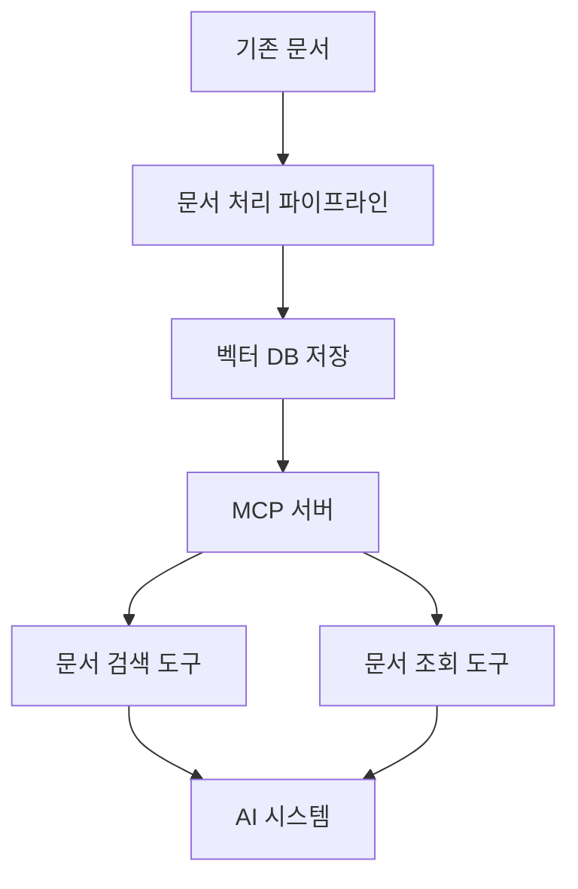
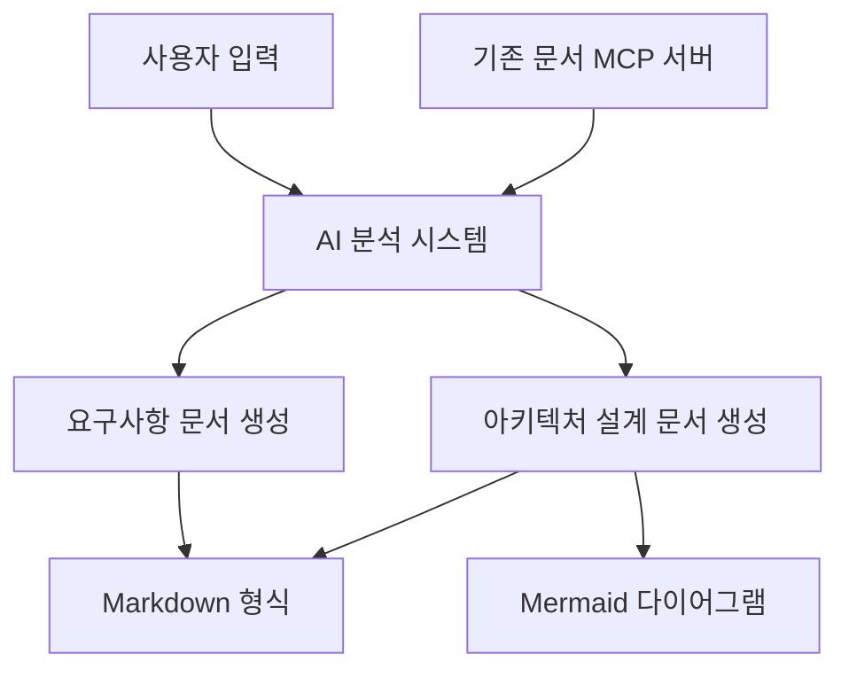

# AI 기반 요구사항 분석 및 설계 지원 시스템

자동차용 인포테인먼트 시스템 개발을 위한 AI 기반 요구사항 분석 및 설계 지원 시스템입니다. 이 시스템은 기존 요구사항 및 설계 문서를 벡터 DB에 저장하고 AI를 활용하여 효율적인 검색과 새로운 요구사항 분석 및 설계 작업을 지원합니다.

## 프로젝트 배경 및 목표

### 현재 상황
- 자동차용 인포테인먼트 시스템 개발 중 (리눅스 기반 임베디드 시스템)
- 기존 요구사항 명세서, 아키텍처 설계 문서, 함수 단위의 상세 설계 문서가 codebeamer, confluence 등에 존재

### 목표
- 기존 요구사항 및 설계 문서를 벡터 DB에 저장하고 AI 기반으로 검색
- 새로운 요구사항 분석 및 설계 작업 지원
- 개발자와 설계자의 작업 효율성 향상
- Markdown과 Mermaid를 활용한 문서 작성 지원

## 시스템 구성 요소

### 1. 벡터 DB 기반 문서 검색 MCP 서버

- 기존 요구사항 및 설계 문서 처리 및 벡터화
- 문서의 의미 단위 분할 및 임베딩 생성
- MCP 프로토콜 기반 검색 및 조회 기능 제공
- 메타데이터 활용을 통한 다양한 검색 시나리오 지원

### 2. AI 기반 요구사항 분석 및 설계 지원 시스템

- 사용자 입력 분석
- 기존 문서 참조를 통한 컨텍스트 이해
- Markdown 및 Mermaid 형식의 문서 생성
- 요구사항과 설계 간의 추적성 유지

## 주요 기능

- **요구사항 문서 검색 및 조회**: 기존 요구사항 문서를 다양한 관점에서 검색하고 조회
- **설계 문서 검색 및 조회**: 아키텍처 및 상세 설계 문서를 검색하고 조회
- **다양한 검색 시나리오 지원**:
  - 사용자 관점 검색: "사용자가 내비게이션에서 할 수 있는 기능은?"
  - 구현 관점 검색: "경로 계산 모듈의 인터페이스는?"
  - 추적성 검색: "REQ-NAV-001과 관련된 모든 컴포넌트는?"
  - 계층적 검색: "내비게이션 시스템의 전체 구조와 세부 요구사항은?"
- **AI 기반 요구사항 분석 및 설계 문서 생성**: 사용자 입력을 분석하여 요구사항 및 설계 문서 작성 지원

## 현재 개발 상태

- **요구사항 문서 검색 시스템**: 설계 완료
- **설계 문서 검색 시스템**: 향후 설계 예정
- **전체 시스템 통합**: 진행 예정

## 관련 문서

- [프로젝트 개요](./projectbrief.md) - 프로젝트의 목표, 현재 상황 및 시스템 아키텍처에 대한 개요
- [요구사항 문서 검색 시스템 설계](./design_for_requirements.md) - 벡터 DB 기반 요구사항 문서 검색 시스템의 상세 설계
- (향후 추가 예정) 설계 문서 검색 시스템 설계
- (향후 추가 예정) 시스템 통합 설계
