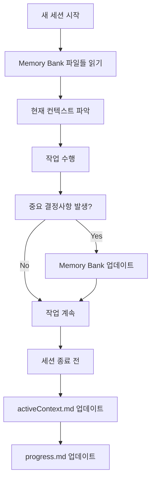
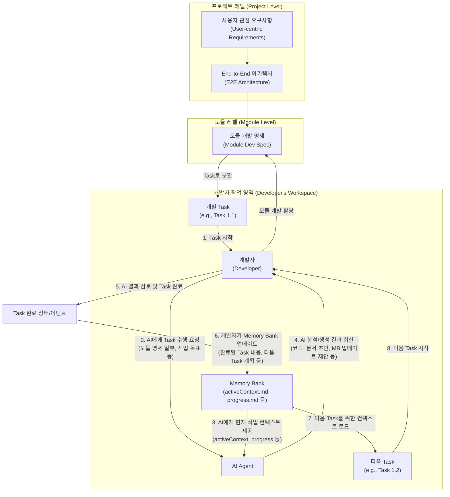

# AI Agent와 코딩을 잘 하는 법: 프로젝트부터 태스크까지 정보 활용 가이드

## 1. 서론: AI Agent 시대, 개발 패러다임의 전환
- AI Agent와 함께 코딩하는 것의 의미와 중요성
- 본 문서의 목적: AI Agent와의 협업 효율을 극대화하기 위한 실용적인 가이드 제공

## 2. AI Agent와의 성공적인 협업을 위한 핵심 원칙
- **명확하고 구조화된 소통**: AI Agent가 이해하기 쉬운 방식으로 작업 지시 (Markdown 활용)
- **컨텍스트는 왕이다**: 프로젝트, 모듈, 파일, 코드 조각 등 작업 단위에 맞는 컨텍스트 제공의 중요성
- **문서 중심 개발 (Code as a Document, CaD)의 실천**: `prompt.md` -> `design.md` -> `code/` 흐름 이해
- **점진적 개발과 반복적 피드백**: 작은 단위로 요청하고, AI의 결과물을 검토하며 개선하는 루프
- **AI의 능력과 한계 명확히 알기**: AI가 잘하는 일과 인간의 판단이 필수적인 영역 구분

## 3. 프로젝트 레벨: 거시적 관점에서 AI Agent 활용하기
- **프로젝트 목표 및 범위 설정**: `projectbrief.md`와 같은 문서를 AI와 공유하고 검토
- **기존 시스템 및 아키텍처 이해**: `systemPatterns.md`, `techContext.md`, `/llms.txt` 등의 정보를 AI에게 제공하여 프로젝트 컨텍스트 학습시키기
- **아키텍처 설계 및 검증**: Mermaid 등을 활용한 시각적 설계 초안을 AI와 함께 만들고, 다양한 관점에서 검증받기
- **기술 스택 선정 자문**: 프로젝트 요구사항 기반으로 AI에게 적합한 기술 스택 및 라이브러리 추천받기
- **프로젝트 계획 및 작업 분할**: AI와 함께 주요 기능 도출, 작업 단위 분할, 우선순위 설정 논의

## 4. 모듈/기능 레벨: 중관적 관점에서 AI Agent 활용하기
- **요구사항 분석 및 명세화**: 사용자 스토리나 `prompt.md`를 기반으로 AI와 함께 상세 요구사항 정의 및 문서화
- **설계 문서 (`design.md`) 작성**:
    - Mermaid 다이어그램을 포함한 모듈 구조, 컴포넌트 상호작용 설계
    - 기존 유사 기능/모듈 설계를 벡터 DB (문서 MCP 서버)를 통해 검색하여 AI에게 컨텍스트로 제공
- **API 인터페이스 설계**: RESTful API 엔드포인트, 요청/응답 데이터 구조 등을 AI와 함께 정의
- **데이터 모델링**: ERD, 클래스 다이어그램 등의 초안을 AI와 함께 설계하고 개선

## 5. 파일/코드 레벨 (Task 레벨): 미시적 관점에서 AI Agent 활용하기
- **코드 생성 및 초안 작성**:
    - `design.md` 또는 상세 로직 설명을 기반으로 특정 함수, 클래스, 알고리즘 구현 요청
    - 반복적인 보일러플레이트 코드, 설정 파일 등 생성
- **코드 리팩토링 및 품질 개선**:
    - 기존 코드 스니펫을 제공하고 가독성, 성능, 유지보수성 측면에서 개선안 제안받기
    - 클린 코드 원칙, 디자인 패턴 적용 제안받기
- **버그 분석 및 수정 지원**:
    - 오류 메시지, 스택 트레이스, 관련 코드, 재현 단계를 AI에게 제공하여 원인 분석 및 해결책 제안받기
- **테스트 코드 자동 생성**:
    - 단위 테스트, 통합 테스트 케이스 및 목(Mock) 객체 생성 요청
    - 경계값 분석, 예외 상황 테스트 등 고려
- **주석 작성 및 코드 문서화**:
    - 코드의 기능, 파라미터, 반환값 등에 대한 주석 자동 생성
    - API 문서 또는 기술 문서 초안 작성 지원
- **새로운 기술/라이브러리 학습 및 적용**:
    - 특정 기술의 사용법, 예제 코드, 모범 사례 등을 AI에게 문의하고 코드에 적용

### 5.1 컨텍스트 윈도우 관리: Task 연속성의 핵심

AI Agent와의 효과적인 협업에서 가장 중요하면서도 간과되기 쉬운 요소가 바로 **컨텍스트 윈도우 관리**입니다. 

#### 컨텍스트 윈도우란?
컨텍스트 윈도우는 AI의 "작업 메모리"로, 한 번에 처리할 수 있는 정보의 양을 토큰(대략 영어 단어의 3/4 정도) 단위로 측정합니다.

**주요 모델별 컨텍스트 한계:**
- **Claude 3.5 Sonnet**: 200k 토큰 (대규모 프로젝트 적합)
- **DeepSeek**: 64k 토큰 (집중적인 작업에 최적)
- **기타 모델**: 128k 토큰 (일반적인 개발 작업)

#### 컨텍스트 진행률 모니터링
```
↑ 입력 토큰 (사용자가 AI에게 보낸 내용)
↓ 출력 토큰 (AI가 생성한 내용)
[████████████░░░░] 75% (150k/200k)
```

**임계점 관리:**
- **70-80% 도달 시**: 전략적 대응 필요
- **90% 이상**: 컨텍스트 "기억상실" 위험

#### 실무 컨텍스트 관리 전략

**1. 작업 유형별 접근법**

```markdown
# 대규모 리팩토링 (Claude 200k 권장)
- 전체 아키텍처 이해 → 모듈별 분할 → 단계적 실행
- 컨텍스트 70% 도달 시 중간 정리 및 문서화

# 집중적 디버깅 (DeepSeek 64k 적합)
- 문제 범위 명확화 → 관련 코드만 포함 → 빠른 해결
- 불필요한 히스토리 제거로 효율성 극대화

# 코드 리뷰 (모델 무관)
- 파일별 또는 기능별 분할 검토
- 각 세션마다 명확한 시작점과 종료점 설정
```

**2. 컨텍스트 효율적 활용 패턴**

```markdown
# 세션 시작 템플릿
## 현재 작업 컨텍스트
- **프로젝트**: [프로젝트명]
- **목표**: [구체적인 목표]
- **현재 상태**: [진행 상황]
- **중요 제약사항**: [기술적/비즈니스 제약]

## 이전 세션 요약 (필요시)
- **완료된 작업**: [주요 성과]
- **결정사항**: [중요한 아키텍처/설계 결정]
- **다음 단계**: [이어서 할 작업]
```

**3. 컨텍스트 전환 시 정보 보존**

```markdown
# 세션 종료 전 체크리스트
□ 주요 결정사항 문서화
□ 다음 세션을 위한 시작점 명시
□ 중요한 코드 스니펫 또는 설정 저장
□ 미해결 이슈 및 고려사항 기록
```

### 5.2 Memory Bank 패턴: 장기 프로젝트 관리

복잡한 프로젝트에서는 단일 세션으로 해결할 수 없는 작업들이 많습니다. 이때 **Memory Bank 패턴**을 활용하여 프로젝트 지식을 체계적으로 관리할 수 있습니다.

#### Memory Bank 구조
```
project/
├── memory-bank/
│   ├── projectbrief.md      # 프로젝트 개요 및 목표
│   ├── activeContext.md     # 현재 작업 컨텍스트
│   ├── systemPatterns.md    # 아키텍처 패턴 및 설계 결정
│   ├── techContext.md       # 기술 스택 및 도구
│   └── progress.md          # 진행 상황 및 완료된 작업
```

#### 각 파일의 역할과 활용법

**projectbrief.md**
```markdown
# 프로젝트 개요
- **목적**: 무엇을 만들고자 하는가?
- **핵심 기능**: 반드시 구현해야 할 기능들
- **성공 기준**: 어떻게 성공을 측정할 것인가?
- **제약사항**: 기술적, 시간적, 예산적 제약

# 타겟 사용자
- **주 사용자**: 누가 이 시스템을 사용하는가?
- **사용 시나리오**: 어떤 상황에서 사용되는가?
```

**activeContext.md**
```markdown
# 현재 작업 상황
- **진행 중인 작업**: [구체적인 작업 내용]
- **최근 변경사항**: [지난 세션에서 완료된 내용]
- **다음 단계**: [이번 세션에서 할 일]

# 중요한 결정사항
- **아키텍처 결정**: [왜 이런 구조를 선택했는가?]
- **기술 선택**: [특정 라이브러리/프레임워크 선택 이유]

# 현재 이슈 및 고려사항
- **해결해야 할 문제**: [기술적 난제들]
- **검토 필요 사항**: [추후 논의가 필요한 부분]
```

#### Memory Bank 활용 워크플로우



### 5.3 실무 시나리오별 컨텍스트 전략

#### 시나리오 1: 대규모 코드베이스 리팩토링

**상황**: 레거시 시스템의 아키텍처 개선
**모델 선택**: Claude 200k (긴 컨텍스트 필요)

```markdown
# 1단계: 전체 구조 파악 (컨텍스트 30-40%)
"현재 시스템의 전체 아키텍처를 분석하고, 주요 컴포넌트 간의 의존성을 파악해주세요."

# 2단계: 문제점 식별 (컨텍스트 50-60%)
"분석 결과를 바탕으로 리팩토링이 필요한 부분을 우선순위별로 정리해주세요."

# 3단계: 단계별 실행 계획 (컨텍스트 70%)
"가장 우선순위가 높은 모듈부터 리팩토링 계획을 세워주세요."

# 컨텍스트 70% 도달 시 → 새 세션 시작
# Memory Bank에 지금까지의 분석 결과와 계획 저장
```

#### 시나리오 2: 특정 버그 디버깅

**상황**: 프로덕션 환경에서 발생한 간헐적 오류
**모델 선택**: DeepSeek 64k (빠른 응답 필요)

```markdown
# 집중적 접근법
1. 오류 로그 및 재현 단계만 포함
2. 관련 없는 코드는 제외
3. 문제 해결에만 집중

# 컨텍스트 효율화
- 전체 코드베이스 대신 문제 영역만 공유
- 이전 디버깅 히스토리는 요약해서 제공
- 해결책 발견 시 즉시 적용 및 테스트
```

#### 시나리오 3: 새로운 기능 개발

**상황**: 기존 시스템에 새 모듈 추가
**모델 선택**: 작업 복잡도에 따라 선택

```markdown
# 단계별 컨텍스트 관리
1. 요구사항 분석 (컨텍스트 20%)
2. 설계 및 아키텍처 결정 (컨텍스트 40%)
3. 구현 (컨텍스트 60%)
4. 테스트 및 통합 (컨텍스트 80%)

# 각 단계별 체크포인트
- 설계 완료 시 → Memory Bank 업데이트
- 핵심 구현 완료 시 → 중간 정리
- 통합 테스트 전 → 새 세션 고려
```

### 5.4 효과적인 프롬프트 패턴

#### 컨텍스트 효율적 프롬프트 구조

```markdown
# 기본 템플릿
## 배경 정보 (간결하게)
- 프로젝트: [한 줄 설명]
- 현재 상황: [핵심 포인트만]

## 구체적 요청
- 목표: [명확한 목표]
- 입력: [필요한 정보]
- 출력: [원하는 결과 형태]

## 제약사항 (있다면)
- 기술적 제약: [특정 라이브러리, 패턴 등]
- 비즈니스 제약: [시간, 성능 요구사항 등]
```

#### 컨텍스트 절약 기법

**1. 점진적 정보 제공**
```markdown
# ❌ 비효율적
"전체 코드베이스를 분석하고 모든 가능한 개선사항을 찾아주세요."

# ✅ 효율적
"먼저 User 모듈의 인증 로직을 검토해주세요. 
문제가 발견되면 다음 단계로 권한 관리 부분을 살펴보겠습니다."
```

**2. 구조화된 응답 요청**
```markdown
# 응답 형태 지정으로 컨텍스트 절약
"다음 형태로 응답해주세요:
1. 문제 요약 (2-3줄)
2. 해결 방안 (코드 포함)
3. 테스트 방법 (간단히)
4. 추가 고려사항 (있다면)"
```

**3. 참조 기반 작업**
```markdown
# 이전 결과 참조
"앞서 설계한 User 클래스 구조를 기반으로 
이제 UserRepository 인터페이스를 구현해주세요."
```

### Task 수행 시 정보 흐름 및 Memory Bank/AI Agent 역할
다음 다이어그램은 개발자가 모듈 내 개별 Task를 수행할 때 정보가 어떻게 흐르고, Memory Bank와 AI Agent가 어떤 역할을 하는지 보여줍니다.



## 6. 실제 사례: 기술 스택별 AI Agent 활용법

### 6.1 Next.js + Supabase 프로젝트

**상황**: 사용자 인증이 포함된 웹 애플리케이션 개발

```markdown
# 프로젝트 시작 프롬프트
## 프로젝트 컨텍스트
- **기술 스택**: Next.js 14 (App Router), Supabase Auth, TypeScript
- **목표**: 사용자 인증과 실시간 데이터 동기화가 포함된 대시보드
- **중요 제약**: SSR 지원 필수, 보안 최우선

## 첫 번째 요청
"Next.js 14 App Router와 Supabase Auth를 사용한 프로젝트 구조를 설계해주세요. 
특히 서버 컴포넌트와 클라이언트 컴포넌트 간의 인증 상태 관리에 중점을 두어주세요."

## 단계별 진행
1. 프로젝트 구조 설계 (컨텍스트 20%)
2. 인증 플로우 구현 (컨텍스트 40%)
3. 보호된 라우트 설정 (컨텍스트 60%)
4. 실시간 기능 구현 (컨텍스트 80%)
```

**핵심 포인트:**
- Supabase의 SSR 패턴 이해 필수
- 클라이언트/서버 컴포넌트 구분 명확히
- 보안 관련 설정은 단계별 검증

### 6.2 Python 데이터 분석 프로젝트

**상황**: 대용량 데이터 처리 및 시각화 파이프라인 구축

```markdown
# 환경 설정 프롬프트
## 기술 컨텍스트
- **도구**: UV (Python 패키지 매니저), Pandas, Plotly, Jupyter
- **데이터**: CSV 파일 (10GB+), 실시간 API 데이터
- **목표**: 자동화된 분석 리포트 생성

## 단계별 접근
1. UV를 사용한 프로젝트 환경 설정
2. 대용량 데이터 처리 최적화
3. 시각화 파이프라인 구축
4. 자동화 스크립트 작성
```

**컨텍스트 관리 전략:**
- 데이터 샘플만 공유 (전체 데이터셋 제외)
- 처리 로직과 시각화 로직 분리
- 성능 최적화는 별도 세션에서 진행

### 6.3 MCP 서버 개발

**상황**: 외부 API와 연동하는 MCP 서버 구축

```markdown
# MCP 개발 프롬프트
## 개발 목표
- **API**: GitHub API 연동
- **기능**: 이슈 관리, PR 리뷰 자동화
- **언어**: TypeScript (Node.js 환경)

## 개발 단계
1. MCP 서버 기본 구조 설정
2. GitHub API 인증 및 연동
3. 도구(Tools) 및 리소스(Resources) 정의
4. 에러 처리 및 로깅 구현
5. 테스트 및 배포
```

**주의사항:**
- MCP 프로토콜 이해 필수
- 각 도구별 개별 테스트 필요
- 인증 정보 보안 처리

### 6.4 Slidev 프레젠테이션 제작

**상황**: 기술 컨퍼런스용 인터랙티브 프레젠테이션

```markdown
# Slidev 프로젝트 프롬프트
## 프레젠테이션 요구사항
- **주제**: AI 개발 도구 소개
- **특징**: 코드 데모, 인터랙티브 요소, 애니메이션
- **시간**: 30분 발표 + 10분 Q&A

## 제작 단계
1. 전체 구조 및 스토리보드 설계
2. 슬라이드 템플릿 및 테마 선택
3. 코드 블록 및 데모 구현
4. 애니메이션 및 전환 효과 추가
5. 발표자 노트 및 타이밍 조정
```

## 7. AI Agent와의 상호작용 효율을 높이는 고급 팁

### 7.1 효과적인 프롬프트 엔지니어링

#### 구조화된 프롬프트 템플릿

```markdown
# 고급 프롬프트 구조
## 역할 정의
"당신은 [구체적 역할]입니다. [관련 경험/지식] 배경을 가지고 있습니다."

## 컨텍스트 설정
- **프로젝트**: [간단한 설명]
- **현재 상황**: [핵심 포인트]
- **제약사항**: [기술적/비즈니스 제약]

## 구체적 요청
- **목표**: [명확한 목표]
- **입력**: [제공하는 정보]
- **출력**: [원하는 결과 형태]
- **품질 기준**: [평가 기준]

## 예시 (선택사항)
[좋은 예시 또는 참고할 패턴]
```

#### 페르소나 기반 프롬프팅

```markdown
# 시니어 아키텍트 페르소나
"당신은 10년 이상의 경험을 가진 시니어 소프트웨어 아키텍트입니다. 
확장성, 유지보수성, 성능을 중시하며, 항상 트레이드오프를 고려합니다."

# 보안 전문가 페르소나
"당신은 사이버 보안 전문가입니다. 
모든 코드와 아키텍처를 보안 관점에서 검토하고, 
잠재적 취약점을 식별하는 것이 주요 역할입니다."

# UX 디자이너 페르소나
"당신은 사용자 경험 디자이너입니다. 
사용자 중심의 관점에서 인터페이스와 워크플로우를 평가하고, 
직관적이고 접근성이 좋은 솔루션을 제안합니다."
```

### 7.2 단계별 지시와 대화형 정제

#### 복잡한 작업 분해 전략

```markdown
# 대규모 작업 분해 예시: 전자상거래 플랫폼 구축

## 1단계: 전체 아키텍처 설계 (컨텍스트 20%)
"전자상거래 플랫폼의 마이크로서비스 아키텍처를 설계해주세요. 
주요 서비스들과 그들 간의 통신 방식을 포함해주세요."

## 2단계: 사용자 서비스 상세 설계 (컨텍스트 40%)
"1단계에서 설계한 사용자 서비스를 상세히 구현해주세요. 
인증, 프로필 관리, 권한 시스템을 포함해주세요."

## 3단계: 결제 시스템 통합 (컨텍스트 60%)
"사용자 서비스와 연동되는 결제 시스템을 설계하고 구현해주세요. 
보안과 트랜잭션 무결성에 특히 주의해주세요."

## 각 단계별 검증
- 설계 검토 및 피드백
- 보안 취약점 점검
- 성능 최적화 고려사항
- 다음 단계 준비사항
```

### 7.3 "생각의 사슬(Chain of Thought)" 프롬프팅

```markdown
# CoT 프롬프트 예시
"다음 문제를 단계별로 분석해주세요:

1. **문제 이해**: 먼저 요구사항을 명확히 파악해주세요
2. **옵션 분석**: 가능한 해결 방안들을 나열하고 각각의 장단점을 분석해주세요
3. **최적 솔루션 선택**: 분석 결과를 바탕으로 최적의 방안을 선택하고 이유를 설명해주세요
4. **구현 계획**: 선택한 솔루션의 구체적인 구현 단계를 제시해주세요
5. **위험 요소**: 예상되는 문제점과 대응 방안을 제시해주세요"
```

### 7.4 AI의 답변 비판적 수용 및 검증

#### 검증 체크리스트

```markdown
# AI 답변 검증 체크리스트
□ **정확성**: 제안된 코드/솔루션이 실제로 작동하는가?
□ **완전성**: 모든 요구사항이 충족되었는가?
□ **보안**: 보안 취약점은 없는가?
□ **성능**: 성능상 문제는 없는가?
□ **유지보수성**: 코드가 이해하기 쉽고 수정하기 용이한가?
□ **확장성**: 향후 확장 가능성을 고려했는가?
□ **모범 사례**: 업계 표준과 모범 사례를 따르고 있는가?
```

#### 반복적 개선 프로세스

```markdown
# 개선 사이클
1. **초기 솔루션 요청**
2. **검토 및 피드백**
   - "이 솔루션에서 성능상 우려되는 부분이 있습니다..."
   - "보안 관점에서 다음 사항을 고려해주세요..."
3. **개선된 솔루션 요청**
4. **최종 검증 및 적용**
```

### 7.5 Memory Bank의 적극적 활용

#### 지속적인 컨텍스트 관리

```markdown
# Memory Bank 업데이트 트리거
- 중요한 아키텍처 결정 시
- 새로운 기술 도입 시
- 성능 최적화 완료 시
- 보안 이슈 해결 시
- 주요 기능 완성 시

# 업데이트 내용
- **결정 배경**: 왜 이런 선택을 했는가?
- **대안 검토**: 어떤 다른 옵션들이 있었는가?
- **트레이드오프**: 어떤 것을 포기하고 얻었는가?
- **향후 고려사항**: 나중에 재검토해야 할 부분은?
```

## 8. 도구별 특화 가이드

### 8.1 개발 환경별 최적화

#### VS Code + Cline 환경
```markdown
# 효율적인 워크플로우
1. **프로젝트 초기화**
   - .clinerules 설정
   - Memory Bank 구조 생성
   - 개발 환경 설정

2. **일일 작업 루틴**
   - Memory Bank 확인
   - 컨텍스트 윈도우 모니터링
   - 정기적인 진행상황 업데이트

3. **세션 관리**
   - 70% 임계점에서 정리
   - 중요 결정사항 문서화
   - 다음 세션 준비
```

#### 터미널 기반 개발
```markdown
# CLI 도구 활용
- **UV (Python)**: 빠른 패키지 관리
- **Git**: 버전 관리 및 협업
- **Docker**: 환경 일관성 보장
- **Make/Just**: 작업 자동화
```

### 8.2 프로젝트 유형별 접근법

#### 웹 애플리케이션
```markdown
# 단계별 개발
1. **설계 단계**: 와이어프레임 → 컴포넌트 설계 → API 설계
2. **구현 단계**: 기본 구조 → 핵심 기능 → 부가 기능
3. **최적화 단계**: 성능 → 보안 → 사용자 경험
```

#### 데이터 분석 프로젝트
```markdown
# 분석 파이프라인
1. **데이터 탐색**: 구조 파악 → 품질 검증 → 전처리
2. **분석 수행**: 기술통계 → 시각화 → 모델링
3. **결과 정리**: 인사이트 도출 → 리포트 작성 → 자동화
```

#### API 서버 개발
```markdown
# 백엔드 개발 순서
1. **아키텍처**: 데이터 모델 → API 설계 → 인프라 설계
2. **핵심 구현**: 인증 → CRUD → 비즈니스 로직
3. **품질 보장**: 테스트 → 문서화 → 모니터링
```

## 9. 실무 체크리스트 및 빠른 참조

### 9.1 프로젝트 시작 체크리스트

```markdown
# 새 프로젝트 시작 시
□ Memory Bank 구조 생성 (projectbrief.md, activeContext.md 등)
□ 기술 스택 및 제약사항 문서화
□ 컨텍스트 윈도우 한계 확인 (모델별)
□ 주요 아키텍처 결정사항 기록
□ 개발 환경 설정 및 도구 준비

# 첫 번째 AI 세션 준비
□ 프로젝트 목표 명확화
□ 핵심 요구사항 정리
□ 기술적 제약사항 파악
□ 성공 기준 정의
□ 우선순위 설정
```

### 9.2 일일 작업 루틴

```markdown
# 세션 시작 전
□ Memory Bank 파일들 확인
□ 이전 세션 결과 검토
□ 오늘의 목표 설정
□ 컨텍스트 윈도우 상태 확인

# 작업 중
□ 컨텍스트 사용률 모니터링 (70% 임계점 주의)
□ 중요 결정사항 즉시 기록
□ 코드 변경사항 추적
□ 문제 발생 시 즉시 문서화

# 세션 종료 전
□ 완료된 작업 정리
□ 다음 단계 계획 수립
□ Memory Bank 업데이트
□ 미해결 이슈 기록
```

### 9.3 컨텍스트 관리 빠른 참조

| 컨텍스트 사용률 | 권장 행동 | 주의사항 |
|---|---|---|
| 0-50% | 정상 진행 | 효율적인 프롬프트 사용 |
| 50-70% | 진행상황 점검 | 불필요한 정보 제거 고려 |
| 70-80% | 정리 및 문서화 | 새 세션 준비 시작 |
| 80-90% | 즉시 정리 필요 | 중요 정보만 보존 |
| 90%+ | 새 세션 시작 | Memory Bank 업데이트 필수 |

### 9.4 모델별 활용 가이드

```markdown
# Claude 3.5 Sonnet (200k)
✅ 적합한 작업:
- 대규모 코드베이스 분석
- 복잡한 아키텍처 설계
- 장시간 디버깅 세션
- 종합적인 코드 리뷰

❌ 비효율적인 사용:
- 단순한 코드 생성
- 빠른 질문/답변
- 반복적인 작업

# DeepSeek (64k)
✅ 적합한 작업:
- 집중적인 버그 수정
- 특정 기능 구현
- 빠른 프로토타이핑
- 단일 파일 작업

❌ 비효율적인 사용:
- 전체 시스템 분석
- 복잡한 아키텍처 논의
- 다중 파일 리팩토링
```

### 9.5 자주 사용하는 프롬프트 템플릿

#### 코드 리뷰 요청
```markdown
# 코드 리뷰 프롬프트
## 검토 대상
- **파일**: [파일명]
- **기능**: [주요 기능 설명]
- **변경사항**: [무엇이 바뀌었는지]

## 검토 관점
□ 코드 품질 (가독성, 유지보수성)
□ 성능 최적화 가능성
□ 보안 취약점
□ 모범 사례 준수
□ 테스트 가능성

## 출력 형태
1. 전체 평가 (2-3줄)
2. 구체적 개선사항 (우선순위별)
3. 칭찬할 부분
4. 추가 고려사항
```

#### 버그 분석 요청
```markdown
# 버그 분석 프롬프트
## 문제 상황
- **증상**: [어떤 문제가 발생하는가?]
- **재현 단계**: [어떻게 재현할 수 있는가?]
- **예상 동작**: [정상적으로는 어떻게 동작해야 하는가?]
- **환경**: [OS, 브라우저, 버전 등]

## 관련 코드
[문제와 관련된 코드 스니펫]

## 로그/에러 메시지
[오류 메시지나 로그]

## 분석 요청
1. 근본 원인 분석
2. 해결 방안 제시
3. 예방 방법 제안
4. 테스트 방법 제시
```

#### 아키텍처 설계 요청
```markdown
# 아키텍처 설계 프롬프트
## 프로젝트 컨텍스트
- **도메인**: [비즈니스 영역]
- **규모**: [사용자 수, 데이터 크기 등]
- **핵심 기능**: [주요 기능 3-5개]

## 기술적 제약
- **기술 스택**: [필수 기술들]
- **성능 요구사항**: [응답시간, 처리량 등]
- **보안 요구사항**: [특별한 보안 고려사항]
- **확장성 요구사항**: [예상 성장률]

## 설계 요청
1. 전체 시스템 아키텍처
2. 주요 컴포넌트 및 책임
3. 데이터 플로우
4. 기술 스택 선택 근거
5. 확장성 고려사항
6. 잠재적 위험 요소
```

### 9.6 문제 해결 플레이북

#### 컨텍스트 오버플로우 대응
```markdown
# 상황: 컨텍스트가 90% 이상 사용됨
1. **즉시 조치**
   - 현재 작업 상태 요약 요청
   - 핵심 결정사항 정리
   - Memory Bank 업데이트

2. **새 세션 준비**
   - 이전 세션 요약 작성
   - 다음 작업 계획 수립
   - 필요한 컨텍스트만 선별

3. **새 세션 시작**
   - 간결한 프로젝트 소개
   - 현재 상황 요약
   - 구체적 작업 목표 제시
```

#### AI 응답 품질이 떨어질 때
```markdown
# 상황: AI가 부정확하거나 불완전한 답변을 제공
1. **프롬프트 개선**
   - 더 구체적인 컨텍스트 제공
   - 예시나 참고 자료 추가
   - 출력 형태 명확히 지정

2. **단계별 접근**
   - 복잡한 작업을 작은 단위로 분할
   - 각 단계별 검증 수행
   - 점진적으로 복잡도 증가

3. **모델 변경 고려**
   - 작업 특성에 맞는 모델 선택
   - 컨텍스트 요구사항 재평가
   - 필요시 전문 도구 활용
```

## 10. 결론: AI Agent와 함께 성장하는 미래의 개발자

### 10.1 핵심 원칙 요약

1. **컨텍스트가 모든 것이다**
   - 명확하고 구조화된 정보 제공
   - 컨텍스트 윈도우 적극적 관리
   - Memory Bank를 통한 지속적 컨텍스트 유지

2. **점진적이고 반복적인 접근**
   - 작은 단위로 작업 분할
   - 각 단계별 검증 및 피드백
   - 지속적인 개선과 학습

3. **도구의 특성 이해**
   - 모델별 강점과 한계 파악
   - 작업 특성에 맞는 도구 선택
   - 효율적인 프롬프트 엔지니어링

4. **비판적 사고 유지**
   - AI 결과물의 검증과 테스트
   - 보안과 성능 관점에서 검토
   - 최종 결정은 개발자가 담당

### 10.2 미래 전망

AI Agent와의 협업은 단순한 도구 사용을 넘어서 새로운 개발 패러다임을 만들어가고 있습니다:

- **개발 속도의 혁신적 향상**: 반복적 작업의 자동화와 빠른 프로토타이핑
- **코드 품질의 일관성**: AI의 모범 사례 적용과 지속적인 리뷰
- **학습 곡선의 단축**: 새로운 기술 습득과 복잡한 문제 해결 지원
- **창의성의 확장**: 루틴 작업에서 해방되어 더 창의적인 문제 해결에 집중

### 10.3 지속적 성장을 위한 제언

1. **실험과 학습의 습관화**
   - 새로운 프롬프트 패턴 시도
   - 다양한 모델과 도구 경험
   - 실패를 통한 학습과 개선

2. **커뮤니티와의 연결**
   - 모범 사례 공유와 학습
   - 새로운 도구와 기법 정보 교환
   - 협업을 통한 집단 지성 활용

3. **균형잡힌 관점 유지**
   - AI의 능력과 한계 정확한 이해
   - 인간의 판단력과 창의성 중시
   - 기술과 인간성의 조화로운 발전

AI Agent는 우리의 개발 여정에서 강력한 파트너가 되었습니다. 이 가이드에서 제시한 원칙과 실무 기법들을 바탕으로, 여러분만의 독특하고 효과적인 AI 협업 스타일을 개발해 나가시기 바랍니다. 

미래의 개발자는 코드를 작성하는 사람이 아니라, AI와 함께 문제를 해결하고 가치를 창조하는 사람이 될 것입니다. 그 여정에서 이 가이드가 유용한 나침반 역할을 하기를 희망합니다.
