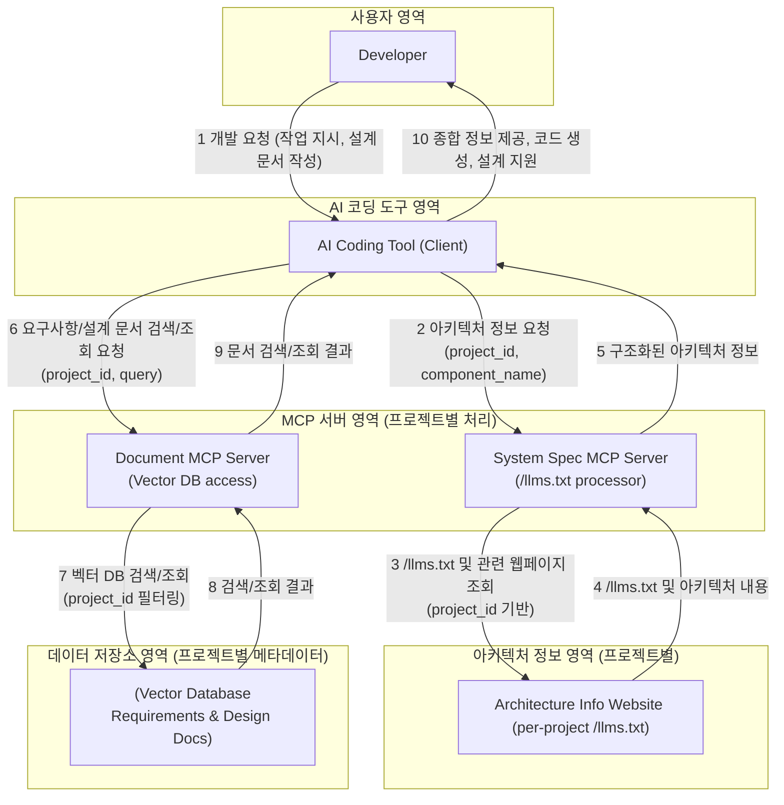

# AI 기반 개발 환경 아키텍처 설계

## 1. 개요

본 문서는 AI 코딩 도구, 프로젝트별 시스템 아키텍처 정보, 그리고 요구사항/설계 문서 데이터베이스를 통합하여 개발 생산성을 향상시키는 AI 지원 개발 환경의 최상위 아키텍처를 기술한다. 이 환경은 다수의 프로젝트를 동시에 지원하며, 각 프로젝트의 컨텍스트를 명확히 구분하여 AI가 정확하고 효율적인 지원을 제공하도록 설계되었다.

## 2. 주요 목표

*   **AI 기반 개발 효율화**: AI를 활용하여 코드 생성, 문서 검색, 아키텍처 이해, 버그 분석 등의 개발 작업을 가속화한다.
*   **프로젝트별 컨텍스트 제공**: 여러 프로젝트의 정보를 명확히 분리하고, AI가 현재 작업 중인 프로젝트의 컨텍스트에 맞는 지원을 제공하도록 한다.
*   **표준화된 정보 접근**: `/llms.txt` 표준을 활용하여 웹 기반 아키텍처 정보를 구조화하고, MCP 서버를 통해 일관된 방식으로 접근한다.
*   **기존 지식 자산 활용**: 벡터 데이터베이스에 저장된 기존 요구사항 및 설계 문서를 AI가 효과적으로 검색하고 활용할 수 있도록 한다.

## 3. 주요 구성 요소 및 책임

1.  **개발자 (Developer)**
    *   AI 코딩 도구를 활용하여 특정 프로젝트의 모듈 개발 및 유지보수 수행.
    *   요구사항 분석, 상세 설계 문서(Markdown) 작성.
    *   AI가 생성한 코드 검토, 수정, 테스트.
    *   필요시 아키텍처 정보 웹사이트 또는 `/llms.txt` 직접 참조.

2.  **AI 코딩 도구 (AI Coding Tool - Client)**
    *   개발자의 요청(자연어, 명령어 등)을 받아 MCP 서버들과 상호작용.
    *   현재 작업 중인 프로젝트 컨텍스트(`project_id`) 관리.
    *   "시스템 명세 MCP 서버"로부터 아키텍처 정보 조회.
    *   "문서 MCP 서버"로부터 요구사항 및 설계 문서 검색/조회.
    *   수집된 정보를 바탕으로 개발자에게 유용한 정보 제공 (예: 설계 초안, 코드 생성, 질의응답).
    *   개발자가 작성한 설계 문서를 코드 생성 입력으로 활용.

3.  **아키텍처 정보 웹사이트 (Architecture Info Website)**
    *   각 프로젝트의 시스템 아키텍처 정보를 웹페이지 형태로 제공.
    *   각 프로젝트별 루트 또는 지정된 경로에 `/llms.txt` 파일을 포함하여, LLM이 아키텍처 정보를 효과적으로 활용할 수 있도록 표준화된 진입점 제공.

4.  **시스템 명세 MCP 서버 (System Spec MCP Server)**
    *   AI 코딩 도구로부터 특정 `project_id`를 포함한 요청 수신.
    *   해당 `project_id`에 해당하는 아키텍처 정보 웹사이트의 `/llms.txt` 파일을 가져와 파싱.
    *   파싱된 `/llms.txt` 정보를 바탕으로 구조화된 아키텍처 정보(개요, 컴포넌트 상세, 관련 문서 링크 등)를 AI 코딩 도구에 제공.
    *   필요시 `/llms.txt`에 링크된 실제 아키텍처 문서(웹페이지 일부 또는 Markdown 파일)의 내용까지 가져와 제공.

5.  **문서 MCP 서버 (Document MCP Server - 기존 `document-vector-db`에 해당)**
    *   AI 코딩 도구로부터 특정 `project_id`를 포함한 검색/조회 요청 수신.
    *   해당 `project_id`를 필터 조건으로 사용하여 벡터 데이터베이스에서 관련 요구사항 및 설계 문서를 검색/조회.
    *   검색/조회 결과를 AI 코딩 도구에 제공.

6.  **벡터 데이터베이스 (Vector Database)**
    *   각 프로젝트의 요구사항 문서, 설계 문서 등을 텍스트 청크로 분할하고 벡터 임베딩하여 저장.
    *   각 문서/청크에 `project_id`를 포함한 메타데이터 저장.
    *   유사도 기반 검색 및 메타데이터 필터링 기능 제공.

## 4. 고수준 아키텍처 다이어그램



## 5. 주요 정보 흐름 및 사용자 시나리오 (상세)

### 5.1. 시나리오 1: 신규 기능 개발 (프로젝트 "Phoenix")

*   **상황**: 개발자 'Alice'는 "Phoenix" 프로젝트의 "결제 모듈"에 "새로운 간편결제 옵션 추가" 기능을 개발해야 합니다.
*   **다이어그램**:
    ```mermaid
    sequenceDiagram
        participant Alice as Developer
        participant AITool as AI Coding Tool
        participant DocMCP as Document MCP Server
        participant SysSpecMCP as System Spec MCP Server
        participant InternalLLM as Internal Logic/LLM

        Alice->>AITool: "Phoenix" 프로젝트 "결제 모듈" 간편결제 기능 개발 요청
        AITool->>DocMCP: 요구사항 검색 (project_id="Phoenix", query="간편결제")
        DocMCP-->>AITool: 관련 요구사항 문서
        AITool->>SysSpecMCP: 아키텍처 정보 요청 (project_id="Phoenix", component="결제 모듈")
        SysSpecMCP-->>AITool: "결제 모듈" 아키텍처 정보
        AITool-->>Alice: 요구사항 및 아키텍처 정보 제공, 설계 지원
        Alice->>AITool: 상세 설계 문서 (Markdown) 제출
        AITool->>InternalLLM: 코드 생성 요청 (설계, 요구사항, 아키텍처 컨텍스트)
        InternalLLM-->>AITool: 생성된 코드
        AITool-->>Alice: 생성된 코드 전달
    ```
*   **단계 및 정보 흐름**:
    1.  **개발자 → AI 코딩 도구**: "Phoenix 프로젝트의 결제 모듈에 간편결제 기능 추가" 요청.
    2.  **AI 코딩 도구 → 문서 MCP 서버**: `project_id="Phoenix"`, "간편결제 요구사항" 검색 요청.
    3.  **문서 MCP 서버 → AI 코딩 도구**: 관련 요구사항 문서 반환.
    4.  **AI 코딩 도구 → 시스템 명세 MCP 서버**: `project_id="Phoenix"`, "결제 모듈" 아키텍처 정보 요청.
    5.  **시스템 명세 MCP 서버 → AI 코딩 도구**: "결제 모듈" 아키텍처 정보 반환.
    6.  **AI 코딩 도구 → 개발자**: 수집된 정보 제공 및 상세 설계 작성 지원.
    7.  **개발자 → AI 코딩 도구**: 작성된 상세 설계 문서(Markdown) 및 코드 생성 요청.
    8.  **AI 코딩 도구 → (내부 로직/LLM)**: 설계, 요구사항, 아키텍처 컨텍스트 기반 코드 생성 요청.
    9.  **(내부 로직/LLM) → AI 코딩 도구**: 생성된 코드 반환.
    10. **AI 코딩 도구 → 개발자**: 생성된 코드 전달.

### 5.2. 시나리오 2: 버그 수정 (프로젝트 "Griffin")

*   **상황**: 개발자 'Bob'은 "Griffin" 프로젝트의 "알림 모듈"에서 발생한 특정 버그(ID: GRIF-123)를 수정해야 합니다.
*   **다이어그램**:
    ```mermaid
    sequenceDiagram
        participant Bob as Developer
        participant AITool as AI Coding Tool
        participant DocMCP as Document MCP Server
        participant SysSpecMCP as System Spec MCP Server

        Bob->>AITool: "Griffin" 프로젝트 "알림 모듈" 버그 GRIF-123 수정 요청
        AITool->>DocMCP: 버그 관련 문서 검색 (project_id="Griffin", query="버그 GRIF-123")
        DocMCP-->>AITool: 버그 리포트, 관련 설계 등
        AITool->>SysSpecMCP: 모듈 아키텍처 요청 (project_id="Griffin", component="알림 모듈")
        SysSpecMCP-->>AITool: "알림 모듈" 아키텍처 정보
        AITool-->>Bob: 수집 정보 제공, 원인 분석 지원
        Bob->>AITool: (선택적) 수정 방향 제시, 테스트 코드 생성 요청
    ```
*   **단계 및 정보 흐름**:
    1.  **개발자 → AI 코딩 도구**: "Griffin 프로젝트 알림 모듈 버그 GRIF-123 수정" 요청.
    2.  **AI 코딩 도구 → 문서 MCP 서버**: `project_id="Griffin"`, "버그 GRIF-123" 또는 "알림 모듈 관련 문서" 검색 요청.
    3.  **문서 MCP 서버 → AI 코딩 도구**: 버그 리포트, 관련 설계 등의 문서 반환.
    4.  **AI 코딩 도구 → 시스템 명세 MCP 서버**: `project_id="Griffin"`, "알림 모듈" 아키텍처 정보 요청.
    5.  **시스템 명세 MCP 서버 → AI 코딩 도구**: "알림 모듈" 아키텍처 정보 반환.
    6.  **AI 코딩 도구 → 개발자**: 수집된 정보 제공 및 버그 원인 분석 지원.
    7.  **개발자 → AI 코딩 도구**: (선택적) 수정 방향 제시, 테스트 코드 생성 요청 등 추가 지원 요청.

### 5.3. 시나리오 3: 신규 프로젝트 참여 및 학습 (프로젝트 "Hydra")

*   **상황**: 개발자 'Charlie'가 "Hydra" 프로젝트에 새로 합류하여 프로젝트 구조와 담당할 모듈("데이터 동기화 서비스")을 파악해야 합니다.
*   **다이어그램**:
    ```mermaid
    sequenceDiagram
        participant Charlie as Developer
        participant AITool as AI Coding Tool
        participant SysSpecMCP as System Spec MCP Server
        participant DocMCP as Document MCP Server

        Charlie->>AITool: "Hydra" 프로젝트 "데이터 동기화 서비스" 정보 요청
        AITool->>SysSpecMCP: 프로젝트/모듈 아키텍처 요청 (project_id="Hydra", component="데이터 동기화 서비스")
        SysSpecMCP-->>AITool: "Hydra" 프로젝트 개요 및 "데이터 동기화 서비스" 상세 정보
        AITool->>DocMCP: 관련 요구사항 검색 (project_id="Hydra", query="데이터 동기화 서비스 요구사항")
        DocMCP-->>AITool: 관련 요구사항 문서
        AITool-->>Charlie: 종합 정보 제공, 질의응답 지원
    ```
*   **단계 및 정보 흐름**:
    1.  **개발자 → AI 코딩 도구**: "Hydra 프로젝트 학습" 또는 "Hydra 프로젝트 데이터 동기화 서비스 정보" 요청.
    2.  **AI 코딩 도구 → 시스템 명세 MCP 서버**: `project_id="Hydra"`, 프로젝트 개요 및 "데이터 동기화 서비스" 상세 정보 요청.
    3.  **시스템 명세 MCP 서버 → AI 코딩 도구**: "Hydra" 프로젝트 아키텍처 및 "데이터 동기화 서비스" 정보 반환.
    4.  **AI 코딩 도구 → 문서 MCP 서버**: `project_id="Hydra"`, "데이터 동기화 서비스 관련 요구사항" 검색 요청.
    5.  **문서 MCP 서버 → AI 코딩 도구**: 관련 요구사항 문서 반환.
    6.  **AI 코딩 도구 → 개발자**: "Hydra" 프로젝트 및 "데이터 동기화 서비스"에 대한 종합 정보 제공 및 질의응답 지원.

## 6. 향후 고려 사항
*   각 MCP 서버의 구체적인 API 명세 정의 (제공 도구 및 리소스 상세화)
*   `/llms.txt`의 상세 형식 및 내용 가이드라인 수립 (프로젝트별 아키텍처 문서 구조화 방안 포함)
*   프로젝트별 정보 접근 권한 관리 방안 (인증 및 인가)
*   AI 코딩 도구와 MCP 서버 간의 인증 및 보안 메커니즘
*   데이터 동기화 및 일관성 유지 방안 (특히 아키텍처 웹사이트 변경 시 `/llms.txt` 및 시스템 명세 MCP 서버 캐시 업데이트 등)
*   오류 처리 및 로깅 전략