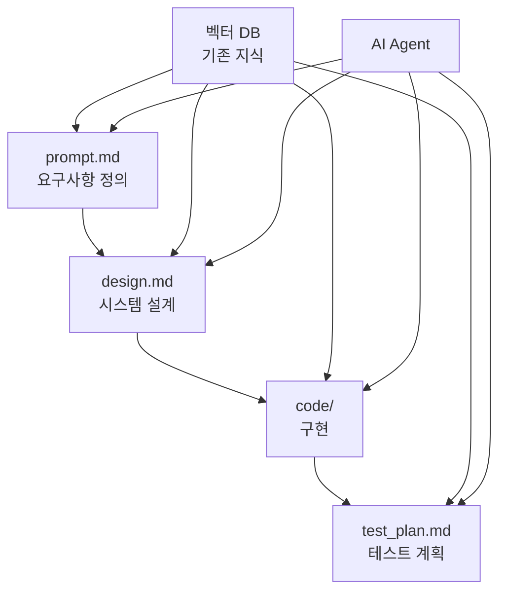

# AI Native Developer 정의

## 핵심 요약

* **AI 파트너십**: AI를 단순한 도구가 아닌 개발 파트너로 인식하고 지속적으로 협업하는 개발자
* **문서 우선 개발**: 코드보다 문서(prompt.md → design.md → code/)에서 시작하는 CaD 워크플로우 실천
* **지식 생태계 활용**: 벡터 DB와 조직의 축적된 지식을 적극적으로 검색하고 재활용하여 개발
* **자동화 중심**: 반복 작업은 AI로 자동화하고 창의적이고 전략적인 작업에 집중
* **10배 생산성**: AI 협업을 통해 기존 개발자 대비 극적인 효율성과 품질 향상을 달성하는 미래형 개발자

---

## AI Native Developer란?

### 핵심 개념
**AI Native Developer**는 AI를 단순한 도구가 아닌 **개발 파트너**로 인식하고, **문서 중심(Document-First)** 개발 방식을 통해 AI와 지속적으로 협업하는 개발자입니다.

### 주요 특징

#### 1. 마인드셋 (Mindset)
- **AI 파트너십**: AI를 보조 도구가 아닌 협업 파트너로 인식
- **문서 우선**: 코드보다 문서에서 시작하는 개발 철학
- **지속적 학습**: 조직의 지식 생태계에서 끊임없이 학습하고 기여
- **반복적 개선**: 완벽보다는 빠른 피드백과 지속적 개선 추구

#### 2. 기술적 역량
- **CaD (Code as a Document) 워크플로우**: prompt.md → design.md → code/ → test_plan.md
- **벡터 DB 활용**: 기존 지식을 효과적으로 검색하고 재활용
- **AI Agent 협업**: Document-to-Document, Document-to-Code 에이전트와 협업
- **MCP 프로토콜**: Model Context Protocol을 통한 AI 시스템 연동

#### 3. 작업 방식
- **문서 기반 설계**: 모든 개발이 명확한 문서에서 시작
- **지식 재활용**: 과거 경험과 조직 지식을 적극적으로 활용
- **자동화 중심**: 반복 작업을 AI로 자동화하고 창의적 작업에 집중
- **실시간 동기화**: 문서와 코드가 항상 일치하도록 관리

#### 4. 협업 능력
- **AI와의 대화**: 자연어로 AI와 효과적으로 소통
- **컨텍스트 제공**: AI가 이해할 수 있는 명확한 컨텍스트 제공
- **피드백 루프**: AI 결과를 평가하고 지속적으로 개선
- **지식 공유**: 개인 경험을 조직 지식으로 체계화

## 기존 개발자와의 차이점

| 구분 | 기존 개발자 | AI Native Developer |
|------|-------------|---------------------|
| **시작점** | 코드 작성 | 문서 작성 |
| **AI 활용** | 코드 자동완성 도구 | 개발 전 과정의 파트너 |
| **지식 관리** | 개인 경험 의존 | 조직 지식 생태계 활용 |
| **문제 해결** | 검색 + 시행착오 | 벡터 DB 검색 + AI 협업 |
| **문서화** | 개발 후 작성 | 개발 전 설계 |
| **품질 관리** | 수동 리뷰 | AI 기반 자동 검증 |

## 필요한 스킬셋

### 기술적 스킬
1. **Markdown 숙련도**: 구조화된 문서 작성 능력
2. **Mermaid/PlantUML**: 다이어그램을 통한 시각적 설계
3. **벡터 DB 이해**: 임베딩과 의미 검색 개념
4. **AI 프롬프팅**: 효과적인 AI 대화 기법
5. **MCP 프로토콜**: AI 시스템 연동 방법

### 소프트 스킬
1. **추상적 사고**: 문제를 문서로 구조화하는 능력
2. **커뮤니케이션**: AI와 인간 모두와 효과적 소통
3. **학습 민첩성**: 새로운 AI 도구 빠른 습득
4. **시스템 사고**: 전체 지식 생태계 관점
5. **협업 마인드**: 개인보다 조직 지식 중시

## 발전 단계

### Level 1: 기초 (Basic)
- Copilot 등 기본 AI 도구 활용
- 간단한 문서 기반 개발 시도
- AI 프롬프팅 기초 이해

### Level 2: 중급 (Intermediate)
- CaD 워크플로우 숙련
- 벡터 DB 검색 활용
- AI Agent와 기본 협업

### Level 3: 고급 (Advanced)
- 복잡한 시스템 설계를 문서로 표현
- 조직 지식 생태계 적극 기여
- AI Agent 커스터마이징

### Level 4: 전문가 (Expert)
- AI Native 방법론 개발 및 전파
- 새로운 AI 도구 평가 및 도입
- 조직의 AI Native 문화 리더

## CaD 워크플로우 예시



## 일반적인 개발 과정

### 1. 문제 정의 (prompt.md)
```markdown
# 사용자 인증 시스템 구현

## 요구사항
- JWT 기반 인증
- 소셜 로그인 지원 (Google, GitHub)
- 역할 기반 권한 관리

## 제약사항
- Node.js + Express 환경
- PostgreSQL 데이터베이스
- 기존 API와 호환성 유지
```

### 2. 설계 문서 (design.md)
```markdown
# 인증 시스템 아키텍처

## 시스템 구조
[Mermaid 다이어그램]

## API 설계
- POST /auth/login
- POST /auth/register
- GET /auth/profile

## 데이터베이스 스키마
[테이블 정의]
```

### 3. 구현 (code/)
- AI Agent가 설계 문서를 기반으로 코드 생성
- 개발자가 리뷰 및 수정
- 지속적인 문서-코드 동기화

### 4. 테스트 계획 (test_plan.md)
```markdown
# 테스트 시나리오

## 단위 테스트
- JWT 토큰 생성/검증
- 사용자 등록/로그인

## 통합 테스트
- 소셜 로그인 플로우
- 권한 검증 시나리오
```

## 미래 전망

AI Native Developer는 단순히 새로운 개발자 유형이 아니라, **미래 소프트웨어 개발의 표준**이 될 것입니다.

### 기대 효과
- **10배 생산성**: AI 협업을 통한 극적인 효율성 향상
- **지식 승수**: 개인 경험이 조직 전체 역량으로 확산
- **혁신 가속**: 반복 작업 자동화로 창의적 작업에 집중
- **품질 혁신**: AI 기반 품질 관리로 버그 최소화

### 조직 차원의 변화
- **지식 생태계**: 모든 개발 경험이 조직 자산으로 축적
- **학습 조직**: 지속적 학습과 개선이 자동화
- **혁신 문화**: AI와 인간의 창의적 협업 문화 정착
- **경쟁 우위**: AI Native 역량이 핵심 차별화 요소

## 시작하기

### 1단계: 기본 도구 익히기
- GitHub Copilot 활용법 학습
- Markdown 문서 작성 연습
- 기본 AI 프롬프팅 기법 습득

### 2단계: 문서 중심 개발 시도
- 간단한 프로젝트에 CaD 워크플로우 적용
- prompt.md → design.md → code/ 순서로 개발
- 문서와 코드의 일관성 유지 연습

### 3단계: AI 협업 심화
- 벡터 DB 기반 지식 검색 활용
- AI Agent와의 협업 패턴 개발
- 조직 지식 생태계 기여

AI Native Developer가 되는 것은 단순한 기술 습득이 아니라, **개발에 대한 사고방식의 근본적 전환**입니다. 이 여정을 통해 더 효율적이고 창의적인 개발자로 성장할 수 있습니다.
