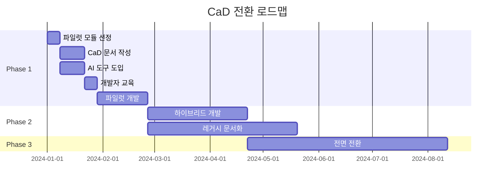
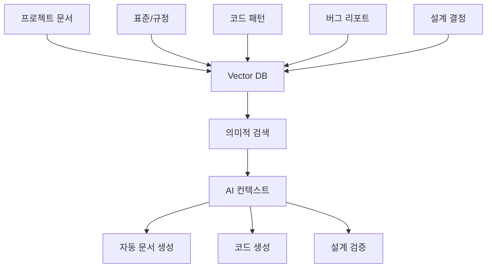
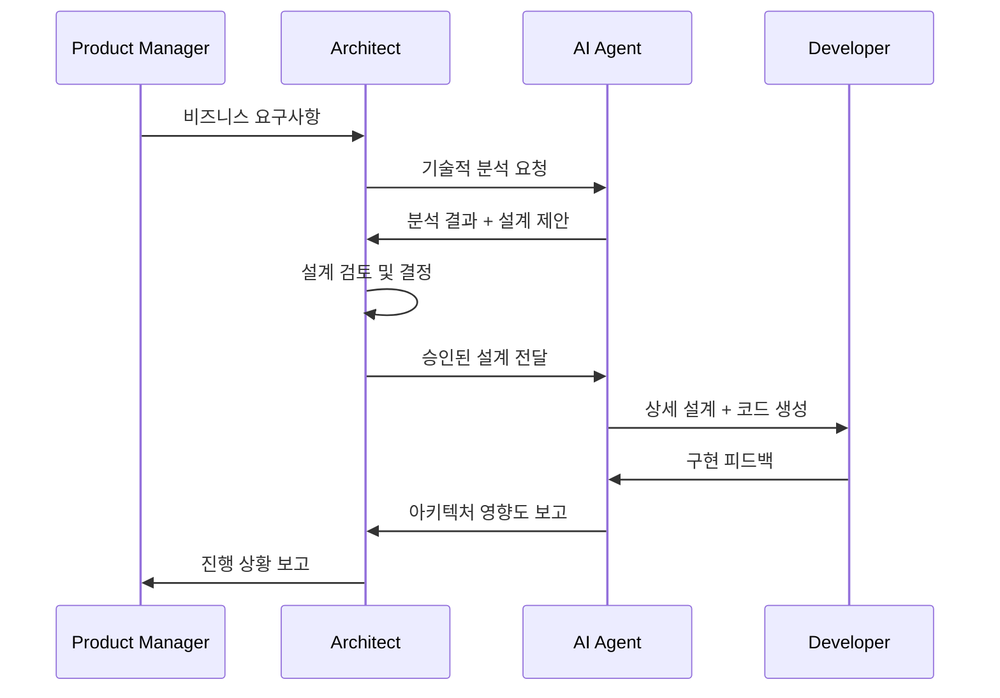
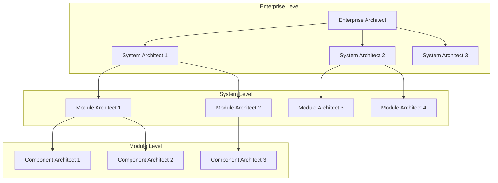
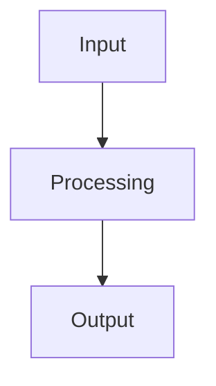

# CaD 아키텍트 가이드
## Code as a Document 방식에서 아키텍트의 새로운 역할

---

## 1. 개요

### CaD 아키텍트란?

Code as a Document (CaD) 방식에서 아키텍트는 전통적인 시스템 설계자 역할을 넘어서, **문서 기반 개발 생태계의 설계자**가 됩니다. AI와 인간이 협업하는 새로운 개발 패러다임에서 아키텍트는 기술적 구조뿐만 아니라 지식 흐름, AI 협업 체계, 문서 아키텍처까지 설계해야 합니다.

### 전통적 아키텍트 vs CaD 아키텍트

| 구분 | 전통적 아키텍트 | CaD 아키텍트 |
|------|----------------|--------------|
| **주요 산출물** | UML, 기술 문서, 코드 리뷰 | 구조화된 Markdown, AI 프롬프트, 문서 템플릿 |
| **설계 대상** | 시스템 구조, 모듈 인터페이스 | 문서 구조 + 시스템 구조 + AI 협업 체계 |
| **협업 방식** | 개발자와 직접 소통 | AI 에이전트를 통한 간접 협업 + 직접 소통 |
| **품질 관리** | 코드 리뷰, 아키텍처 검증 | 문서 품질 + AI 출력 품질 + 시스템 품질 |
| **지식 관리** | 개인 경험, 팀 위키 | Vector DB, 구조화된 지식 체계 |

---

## 2. CaD 아키텍트의 6가지 핵심 역할

### 2.1 문서 아키텍처 설계자 (Document Architecture Designer)

#### 역할 정의
대규모 시스템을 계층적 문서 구조로 분해하고, 각 문서 간의 의존성과 정보 흐름을 설계합니다.

#### 주요 업무
- **계층적 문서 구조 설계**
  ```
  /enterprise_system/
  ├── system/                    # 시스템 레벨
  │   ├── requirements.md       # 전체 시스템 요구사항
  │   ├── design.md             # 시스템 아키텍처
  │   ├── constraints.md        # 시스템 제약사항
  │   └── integration.md        # 시스템 간 연동 방안
  ├── domains/                   # 도메인 레벨
  │   ├── user_management/
  │   ├── payment/
  │   ├── inventory/
  │   └── analytics/
  ├── modules/                   # 모듈 레벨
  │   ├── auth/
  │   ├── api_gateway/
  │   ├── notification/
  │   └── logging/
  └── components/                # 컴포넌트 레벨
      ├── ui_components/
      ├── database_schemas/
      └── external_apis/
  ```

- **문서 간 의존성 매트릭스 정의**
  ```mermaid
  graph TD
      A[System requirements.md] --> B[Domain requirements.md]
      B --> C[Module requirements.md]
      C --> D[Component spec.md]
      
      E[System design.md] --> F[Domain design.md]
      F --> G[Module design.md]
      G --> H[Component design.md]
      
      A -.-> E
      B -.-> F
      C -.-> G
      D -.-> H
  ```

#### 실무 가이드
1. **문서 템플릿 표준화**: 각 레벨별 표준 문서 구조 정의
2. **변경 영향도 분석**: 상위 문서 변경이 하위 문서에 미치는 영향 추적
3. **문서 버전 관리**: Git 기반 문서 형상관리 전략 수립

### 2.2 AI 프롬프트 아키텍트 (AI Prompt Architect)

#### 역할 정의
AI 에이전트가 효과적으로 작업할 수 있도록 프롬프트 체계를 설계하고, AI-Human 인터페이스를 정의합니다.

#### 주요 업무
- **AI 명령어 체계 설계**
  ```markdown
  # AI Agent Commands for System Level
  
  ## Architecture Generation
  - `mcp://generate-architecture?input=system/requirements.md&output=system/design.md`
  - `mcp://validate-architecture?design=system/design.md&constraints=system/constraints.md`
  
  ## Module Decomposition  
  - `mcp://decompose-modules?system_design=system/design.md&output_dir=modules/`
  - `mcp://generate-interfaces?modules=modules/*/design.md&output=system/interfaces.md`
  
  ## Impact Analysis
  - `mcp://analyze-impact?change=system/change_request.md&scope=full_system`
  ```

- **컨텍스트 관리 전략**
  - 각 AI 작업별 필요한 문서 컨텍스트 정의
  - Vector DB 검색 쿼리 최적화
  - AI 메모리 관리 및 세션 전략

#### 실무 가이드
1. **프롬프트 패턴 라이브러리**: 재사용 가능한 프롬프트 템플릿 구축
2. **AI 품질 관리**: AI 출력 품질 검증 체크리스트 작성
3. **에러 핸들링**: AI 실패 시 대응 방안 정의

### 2.3 변화 관리 리더 (Transformation Leader)

#### 역할 정의
기존 개발 조직을 CaD 방식으로 전환하는 변화 관리를 주도합니다.

#### 전환 로드맵

**Phase 1: 파일럿 프로젝트 (1-2개월)**


**Phase 2: 하이브리드 개발 (2-3개월)**
- 신규 기능: 100% CaD 방식
- 기존 코드: 점진적 문서화
- 인터페이스 설계: 레거시 ↔ CaD 연동

**Phase 3: 전면 전환 (4-6개월)**
- 전체 시스템 CaD 구조 재구성
- AI 자동화 파이프라인 구축
- 성과 측정 및 최적화

#### 변화 관리 전략
1. **저항 요인 분석 및 대응**
   - 개발자 우려사항: "AI가 내 일을 대체할까?"
   - 대응: AI는 도구, 개발자는 더 창의적 업무에 집중
   
2. **교육 프로그램**
   - CaD 개념 교육 (4시간)
   - Markdown + Mermaid 실습 (8시간)
   - AI 도구 활용법 (16시간)
   - 실제 프로젝트 적용 (40시간)

3. **성과 측정 지표**
   - 개발 속도: 기능 구현 시간 단축률
   - 품질: 버그 발생률, 코드 리뷰 시간
   - 만족도: 개발자 만족도, 학습 곡선

### 2.4 지식 관리 아키텍트 (Knowledge Management Architect)

#### 역할 정의
조직의 개발 지식을 체계화하고, AI가 활용할 수 있는 지식 베이스를 구축합니다.

#### 지식 체계 설계


#### 주요 업무
1. **문서 표준화**
   - 모든 프로젝트 동일한 문서 구조 적용
   - 메타데이터 스키마 정의
   - 태깅 및 분류 체계 구축

2. **지식 큐레이션**
   - 고품질 문서 선별 및 정제
   - AI 학습용 데이터셋 구축
   - 지식 갱신 주기 관리

3. **검색 최적화**
   - 임베딩 모델 선택 및 튜닝
   - 검색 쿼리 최적화
   - 컨텍스트 랭킹 알고리즘

### 2.5 AI-Human 협업 설계자 (AI-Human Collaboration Designer)

#### 역할 정의
AI와 인간의 최적 협업 방식을 설계하고, 각자의 강점을 극대화하는 워크플로우를 구축합니다.

#### 역할 분담 매트릭스

| 개발 단계 | 인간의 역할 | AI의 역할 | 협업 방식 |
|-----------|-------------|-----------|-----------|
| **요구사항 분석** | 비즈니스 목표 정의, 제약사항 식별 | 기술적 요구사항 분석, 유사 사례 검색 | 인간이 주도, AI가 보조 |
| **아키텍처 설계** | 핵심 설계 결정, 전략적 선택 | 상세 설계, 패턴 적용, 대안 제시 | 인간이 결정, AI가 실행 |
| **상세 설계** | 비즈니스 로직 검증, 예외 상황 정의 | 기술적 상세 설계, 인터페이스 정의 | AI가 주도, 인간이 검증 |
| **코드 생성** | 코드 리뷰, 품질 검증 | 자동 코드 생성, 테스트 코드 작성 | AI가 생성, 인간이 승인 |
| **테스트** | 시나리오 정의, 결과 해석 | 테스트 케이스 생성, 자동 실행 | 인간이 계획, AI가 실행 |
| **유지보수** | 변경 요구사항 분석, 우선순위 결정 | 영향도 분석, 자동 수정 제안 | 인간이 판단, AI가 분석 |

#### 협업 워크플로우


### 2.6 품질 관리자 (Quality Assurance Architect)

#### 역할 정의
CaD 방식에서 문서 품질, AI 출력 품질, 최종 시스템 품질을 통합 관리합니다.

#### 품질 관리 체계
1. **문서 품질 관리**
   - 문서 완성도 체크리스트
   - 문서 간 일관성 검증
   - 버전 관리 및 변경 추적

2. **AI 출력 품질 관리**
   - AI 생성 코드 품질 기준
   - 자동 검증 파이프라인
   - 인간 검토 가이드라인

3. **시스템 품질 관리**
   - 통합 테스트 자동화
   - 성능 모니터링
   - 보안 검증

---

## 3. 대규모 프로젝트 적용 방안

### 3.1 계층적 책임 분담



### 3.2 문서 거버넌스

#### 문서 승인 체계
- **Enterprise Level**: CTO, EA 승인
- **System Level**: EA, SA 승인  
- **Module Level**: SA, MA 승인
- **Component Level**: MA, 개발팀 리더 승인

#### 변경 관리 프로세스
1. **변경 요청 접수**: 표준 템플릿 사용
2. **영향도 분석**: AI 기반 자동 분석 + 인간 검증
3. **승인 프로세스**: 계층별 승인 체계
4. **변경 실행**: AI 에이전트 기반 자동 업데이트
5. **검증 및 배포**: 자동 테스트 + 인간 최종 승인

---

## 4. 실무 도구 및 템플릿

### 4.1 문서 템플릿

#### System Level requirements.md 템플릿
```markdown
# [시스템명] 요구사항 정의

## 1. 비즈니스 목표
- 주요 목표:
- 성공 지표:
- 제약사항:

## 2. 기능 요구사항
### 2.1 핵심 기능
- 기능 1:
- 기능 2:

### 2.2 부가 기능
- 기능 A:
- 기능 B:

## 3. 비기능 요구사항
- 성능: 
- 확장성:
- 보안:
- 가용성:

## 4. 기술적 제약사항
- 플랫폼:
- 기술 스택:
- 통합 요구사항:

## 5. AI Agent 지시사항
```mcp://generate-system-design
input: 이 문서의 모든 요구사항
output: system/design.md
constraints: system/constraints.md
patterns: enterprise_patterns.md
```
```

#### Module Level design.md 템플릿
```markdown
# [모듈명] 설계 문서

## 1. 모듈 개요
- 목적:
- 책임:
- 경계:

## 2. 아키텍처


## 3. 인터페이스 정의
### 3.1 입력 인터페이스
### 3.2 출력 인터페이스
### 3.3 의존성

## 4. 데이터 모델
### 4.1 엔티티
### 4.2 관계

## 5. 비즈니스 로직
### 5.1 핵심 알고리즘
### 5.2 예외 처리

## 6. AI Agent 지시사항
```mcp://generate-module-code
input: 이 설계 문서
output: code/[module_name]/
tests: test/[module_name]/
```
```

### 4.2 AI 명령어 라이브러리

#### 아키텍처 생성 명령어
```markdown
# Architecture Generation Commands

## System Level
- `mcp://analyze-requirements?input=system/requirements.md&context=enterprise_context`
- `mcp://generate-architecture?requirements=system/requirements.md&output=system/design.md`
- `mcp://validate-architecture?design=system/design.md&constraints=system/constraints.md`

## Module Level  
- `mcp://decompose-system?system_design=system/design.md&output_dir=modules/`
- `mcp://generate-module-design?module=modules/[name]/requirements.md&output=modules/[name]/design.md`
- `mcp://validate-interfaces?modules=modules/*/design.md&output=system/interface_validation.md`

## Component Level
- `mcp://generate-components?module_design=modules/[name]/design.md&output_dir=components/[name]/`
- `mcp://generate-code?component_spec=components/[name]/spec.md&output=code/[name]/`
```

### 4.3 품질 체크리스트

#### 문서 품질 체크리스트
- [ ] 요구사항이 명확하고 측정 가능한가?
- [ ] 아키텍처 다이어그램이 포함되어 있는가?
- [ ] AI 명령어가 정확하게 정의되어 있는가?
- [ ] 의존성이 명시되어 있는가?
- [ ] 제약사항이 문서화되어 있는가?

#### AI 출력 품질 체크리스트
- [ ] 생성된 코드가 요구사항을 만족하는가?
- [ ] 코딩 표준을 준수하는가?
- [ ] 테스트 코드가 포함되어 있는가?
- [ ] 문서와 코드가 일치하는가?
- [ ] 보안 취약점이 없는가?
