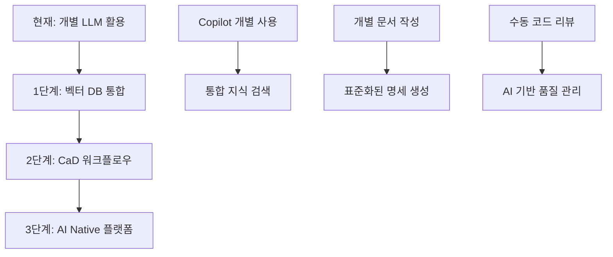
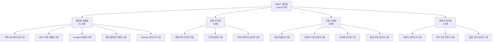
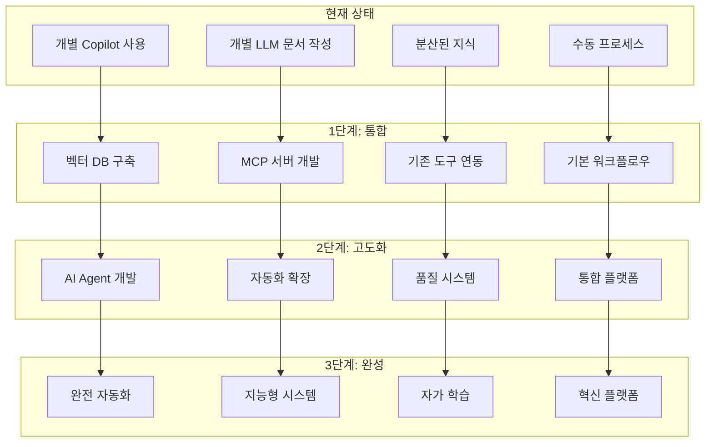
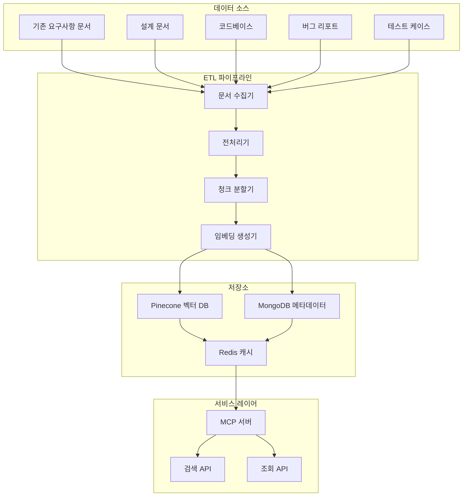
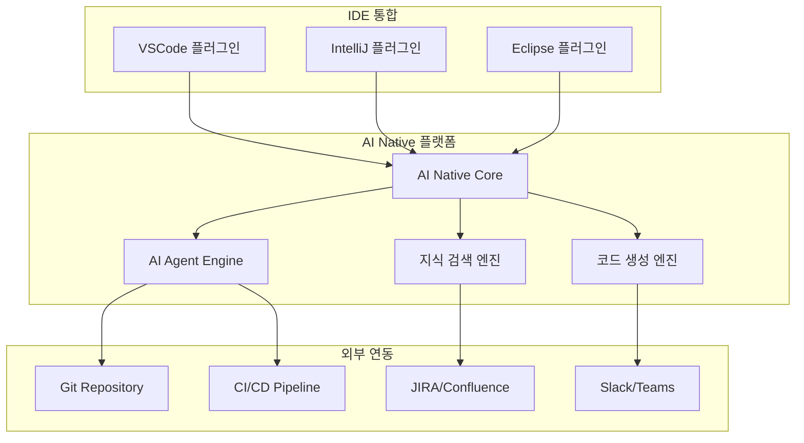
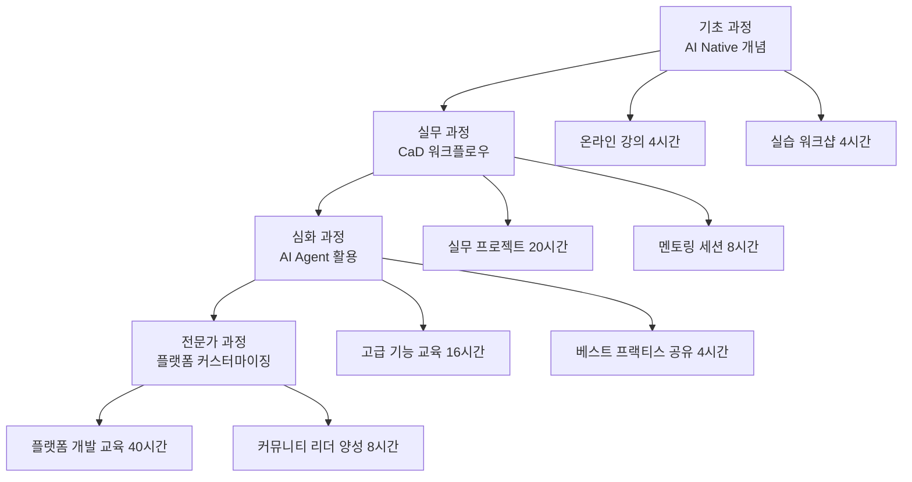
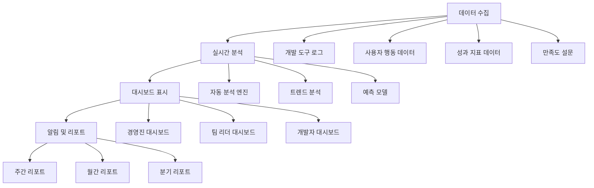

# AI Native Development Framework 전환 전략

## 1. 현재 상황 분석

### 1.1 조직 현황
- **개발자 규모**: 1,000명
- **현재 AI 도구 활용**: GitHub Copilot 등 AI 코딩 도구 사용 중
- **LLM 활용 현황**: 요구사항 분석, 설계서 작성, 테스트 케이스 작성에 LLM 활용
- **개발 성숙도**: AI 도구에 대한 기본적 이해와 경험 보유

### 1.2 현재 AI 활용의 한계
- **개별적 활용**: 각자 다른 도구와 방식으로 LLM 활용
- **지식 분산**: 개인별 경험과 노하우가 조직 차원에서 공유되지 않음
- **일관성 부족**: 표준화된 프로세스나 품질 기준 없음
- **확장성 제한**: 개별 도구 사용으로 인한 조직 차원의 시너지 부족

### 1.3 AI Native Framework 도입 준비도
**강점**:
- 기존 AI 도구 사용 경험으로 인한 변화 수용성
- LLM 기반 문서 작성 경험
- 대규모 조직의 체계적 변화 관리 역량

**과제**:
- 개별 활용에서 통합 플랫폼으로의 전환 필요
- 문서 중심 개발 문화로의 패러다임 변화 필요
- 벡터 DB, MCP 서버 등 새로운 기술 스택 학습 필요

## 2. AI Native Development Framework 전환 비전

### 2.1 목표
**"1000명 개발자가 하나의 지식 생태계에서 AI와 협업하는 조직"**

- **통합된 지식 기반**: 모든 요구사항, 설계, 코드, 버그가 하나의 벡터 DB에 통합
- **표준화된 워크플로우**: Document-to-Document, Document-to-Code 프로세스 정착
- **지속적 학습**: 조직의 모든 경험이 AI 시스템에 축적되어 지속적 개선
- **혁신적 생산성**: 개발 속도 2배 향상, 품질 50% 개선

### 2.2 핵심 변화 요소

#### A. 기술적 변화


#### B. 프로세스 변화
- **기존**: 요구사항 → 설계 → 코딩 → 테스트 (순차적)
- **AI Native**: requirements.md → design.md → code/ → test_plan.md (문서 기반 통합)

#### C. 문화적 변화
- **Code First → Document First**: 모든 것이 문서에서 시작
- **Individual → Collaborative**: AI와의 지속적 협업
- **Static → Dynamic**: 문서와 코드의 실시간 동기화

## 3. 전담 조직 구성: AI Native Development Center (ANDC)

### 3.1 조직 구조



### 3.2 팀별 상세 역할

#### 플랫폼 개발팀 (8-10명)
- **벡터 DB 엔지니어**: Pinecone 최적화, 임베딩 성능 튜닝
- **MCP 서버 개발자**: 검색/조회 API, 실시간 응답 최적화
- **AI Agent 개발자**: Document-to-Document, Document-to-Code 에이전트
- **통합 플랫폼 개발자**: VSCode/IntelliJ 플러그인, CI/CD 통합
- **DevOps 엔지니어**: 인프라 관리, 자동 배포, 모니터링

#### 변화 관리팀 (5-6명)
- **변화 관리 전문가**: 전략 수립, 로드맵 관리, 저항 관리
- **교육 담당자**: 교육 프로그램 개발, 워크샵 진행, 인증 체계
- **커뮤니케이션 담당자**: 내부 홍보, 성공 사례 전파, 피드백 수집

#### 기술 지원팀 (6-8명)
- **기술 컨설턴트**: 팀별 맞춤 지원, 아키텍처 가이드, 베스트 프랙티스
- **사용자 지원 담당자**: 헬프데스크 운영, 실시간 지원, 트러블슈팅
- **문서화 담당자**: 가이드 작성, API 문서, 사용자 매뉴얼
- **품질 보증 담당자**: 도구 품질 검증, 사용자 경험 개선

#### 데이터 관리팀 (4-5명)
- **데이터 엔지니어**: 문서 수집 파이프라인, ETL 프로세스, 데이터 품질
- **지식 관리 전문가**: 문서 분류 체계, 메타데이터 관리, 온톨로지
- **품질 관리 담당자**: 데이터 일관성, 중복 제거, 정확성 검증

### 3.3 단계별 조직 확장 (18개월 완료)

#### 1단계: 핵심 팀 구성 (3-4개월)
- **규모**: 12-15명 (기존 8-10명에서 확대)
- **구성**: 각 팀 리더 + 핵심 개발자 + 외부 전문가
- **인력 확보**: 기존 LLM 활용 경험자 우선 선발 + 외부 전문가 조기 영입

#### 2단계: 조직 확장 (4-10개월)
- **규모**: 20-25명
- **구성**: 각 팀 완전 구성 + 추가 전문가
- **인력 확보**: 내부 전환 + 신규 채용 + 컨설턴트 활용

#### 3단계: 완전 조직 (8-18개월)
- **규모**: 25-30명
- **구성**: 안정적 운영 체계 + 혁신 팀
- **인력 확보**: 지속적 역량 강화 + 전문성 심화 + 글로벌 인재

## 4. 3단계 전환 로드맵 (18개월 완료)

### 4.1 1단계: 파일럿 프로젝트 (3-4개월)

#### 목표
- **개념 증명**: AI Native Framework의 실효성 검증
- **초기 성과**: 측정 가능한 개선 효과 창출
- **학습 및 개선**: 실제 적용을 통한 프로세스 최적화

#### 범위
- **대상**: 15-25명의 선도 팀 (기존 LLM 활용 경험자 우선)
- **프로젝트**: 신규 프로젝트 또는 독립적 모듈 개발
- **기간**: 3-4개월

#### 핵심 활동

**기술적 구현**:
- 기존 요구사항/설계 문서 500-1000건 벡터화
- 기본 MCP 서버 구축 (검색/조회 기능)
- CaD 워크플로우 템플릿 개발
- VSCode 플러그인 프로토타입

**프로세스 적용**:
```
기존 LLM 활용 → AI Native 워크플로우
개별 문서 작성 → requirements.md → design.md → code/
수동 코드 리뷰 → AI 기반 품질 검증
```

**교육 및 지원**:
- 선도 팀 집중 교육 (40시간)
- 1:1 멘토링 프로그램
- 주간 피드백 세션

#### 성공 지표
- **개발 속도**: 기능 개발 시간 30% 단축
- **문서 품질**: 일관성 점수 80% 이상
- **사용자 만족도**: 8/10 이상
- **지식 재활용**: 기존 문서 참조율 60% 이상

### 4.2 2단계: 점진적 확산 (4-10개월)

#### 목표
- **성공 사례 확산**: 파일럿 성과를 조직 전체에 전파
- **플랫폼 안정화**: 더 많은 사용자를 지원할 수 있는 시스템 구축
- **문화 변화**: AI Native 개발 문화의 조직 내 확산
- **병렬 실행**: 1단계와 중첩하여 빠른 확산 추진

#### 범위
- **대상**: 150-300명 (전체의 15-30%)
- **프로젝트**: 다양한 팀, 여러 프로젝트 유형
- **기간**: 4-10개월 (1단계와 2개월 중첩)

#### 핵심 활동

**플랫폼 확장**:
- 벡터 DB 확장 (5,000-10,000건 문서)
- MCP 서버 고도화 (성능 최적화, 고급 검색)
- AI Agent 개발 (자동 코드 생성, 테스트 케이스 생성)
- 다양한 IDE 지원 (IntelliJ, Eclipse 등)

**프로세스 표준화**:
- CaD 개발 표준 수립
- 코드 리뷰 가이드라인
- 품질 게이트 정의
- 성과 측정 체계

**조직 지원**:
- 챔피언 네트워크 구축 (각 팀 1-2명)
- 정기 워크샵 (월 1회)
- 성공 사례 공유 세션
- 내부 커뮤니티 플랫폼

#### 성공 지표
- **채택률**: 대상 팀의 80% 이상 활용
- **생산성**: 전체 개발 속도 25% 향상
- **품질**: 버그 발생률 30% 감소
- **지식 축적**: 벡터 DB 활용률 70% 이상

### 4.3 3단계: 전사 전환 (8-18개월)

#### 목표
- **전사 적용**: 모든 개발자가 AI Native 방식으로 작업
- **문화 정착**: AI Native 개발이 조직의 기본 문화로 정착
- **지속적 혁신**: 축적된 지식을 바탕으로 한 지속적 개선
- **가속화된 전개**: 2단계와 병렬 진행으로 빠른 전사 확산

#### 범위
- **대상**: 전체 1,000명
- **프로젝트**: 모든 프로젝트, 레거시 시스템 포함
- **기간**: 8-18개월 (2단계와 6개월 중첩)

#### 핵심 활동

**전사 플랫폼**:
- 엔터프라이즈급 벡터 DB (50,000+ 문서)
- 고성능 MCP 서버 클러스터
- 완전 자동화된 AI Agent
- 통합 개발 환경

**레거시 통합**:
- 기존 시스템과의 연동
- 점진적 마이그레이션 계획
- 하이브리드 개발 환경 지원

**지속적 개선**:
- AI 모델 지속 학습
- 사용자 피드백 자동 반영
- 성능 모니터링 및 최적화
- 새로운 기술 도입

#### 성공 지표
- **전사 생산성**: 개발 속도 50% 향상
- **혁신 속도**: 신기능 출시 주기 40% 단축
- **지식 재활용**: 중복 개발 70% 감소
- **개발자 만족도**: 9/10 이상

## 5. 기술적 마이그레이션 계획

### 5.1 현재 상태에서 AI Native로의 진화

#### 기존 LLM 활용 → 통합 AI Native 플랫폼



### 5.2 기술 스택 및 아키텍처

#### 벡터 DB 아키텍처


#### 통합 개발 환경


### 5.3 단계별 기술 구현

#### 1단계: 기반 인프라 (3-6개월)
- **벡터 DB**: Pinecone 클러스터 구축, 기본 인덱스 생성
- **MCP 서버**: Node.js/TypeScript 기반 기본 서버
- **문서 처리**: LangChain 기반 ETL 파이프라인
- **IDE 플러그인**: VSCode 기본 플러그인

#### 2단계: 플랫폼 확장 (6-12개월)
- **AI Agent**: OpenAI GPT-4 기반 Document-to-Document 에이전트
- **고급 검색**: 의미 검색, 하이브리드 검색, 필터링
- **자동화**: CI/CD 통합, 자동 문서 업데이트
- **다중 IDE**: IntelliJ, Eclipse 플러그인 추가

#### 3단계: 완전 플랫폼 (12-24개월)
- **지능형 Agent**: 자가 학습, 컨텍스트 인식, 개인화
- **실시간 협업**: 실시간 문서 동기화, 팀 협업 기능
- **고급 분석**: 코드 품질 분석, 성능 예측, 위험 분석
- **확장성**: 마이크로서비스 아키텍처, 클라우드 네이티브

## 6. 변화 관리 전략

### 6.1 조직 문화 변화 관리

#### 현재 문화 → AI Native 문화

| 현재 문화 | AI Native 문화 | 변화 전략 |
|-----------|----------------|-----------|
| 코드 중심 개발 | 문서 중심 개발 | CaD 워크플로우 교육 및 실습 |
| 개별 작업 | AI 협업 | AI 파트너십 마인드셋 교육 |
| 완벽주의 | 반복 개선 | 애자일 + AI 방법론 도입 |
| 경험 의존 | 데이터 기반 | 벡터 DB 활용 성공 사례 공유 |
| 수동 프로세스 | 자동화 | 자동화 도구 체험 및 효과 실감 |

#### 변화 저항 관리

**예상 저항 요소**:
- 기존 방식에 대한 애착
- 새로운 도구 학습 부담
- AI에 대한 불신 또는 두려움
- 성과 평가에 대한 우려

**대응 전략**:
- **점진적 도입**: 강제가 아닌 선택적 참여로 시작
- **성공 경험**: 빠른 성공 경험을 통한 확신 제공
- **충분한 지원**: 교육, 멘토링, 기술 지원
- **인센티브**: AI Native 활용에 대한 명확한 보상

### 6.2 교육 및 역량 강화

#### 교육 체계



#### 역할별 교육 프로그램

**개발자**:
- AI Native 개발 기초 (8시간)
- CaD 워크플로우 실습 (16시간)
- AI Agent 활용법 (12시간)
- 지속적 학습 (월 4시간)

**아키텍트/리드**:
- AI Native 아키텍처 설계 (20시간)
- 팀 전환 리더십 (8시간)
- 플랫폼 고급 활용 (16시간)
- 변화 관리 (8시간)

**PM/PO**:
- AI Native 프로젝트 관리 (12시간)
- 문서 기반 요구사항 관리 (8시간)
- 성과 측정 및 분석 (8시간)
- 이해관계자 커뮤니케이션 (4시간)

### 6.3 커뮤니케이션 전략

#### 내부 홍보 및 인식 개선

**메시지 전략**:
- **비전**: "AI와 함께하는 미래의 개발 방식"
- **가치**: "더 빠르고, 더 정확하고, 더 창의적인 개발"
- **혜택**: "반복 작업 감소, 창의적 작업 증가, 지속적 학습"

**커뮤니케이션 채널**:
- 전사 타운홀 미팅 (월 1회)
- AI Native 뉴스레터 (주 1회)
- 성공 사례 블로그 (주 2회)
- 내부 팟캐스트 (월 2회)
- Slack 커뮤니티 (상시)

#### 성공 사례 전파

**사례 수집 및 분석**:
- 정량적 성과 (개발 시간, 품질 지표)
- 정성적 경험 (개발자 인터뷰, 팀 후기)
- 비교 분석 (Before/After)
- 교훈 및 베스트 프랙티스

**전파 방법**:
- 사례 발표회 (월 1회)
- 동영상 제작 및 공유
- 내부 컨퍼런스 발표
- 외부 컨퍼런스 참여

## 7. 위험 관리 및 대응 방안

### 7.1 주요 위험 요소

#### 기술적 위험

| 위험 요소 | 영향도 | 발생 확률 | 대응 전략 |
|-----------|--------|-----------|-----------|
| 벡터 DB 성능 이슈 | 높음 | 중간 | 성능 테스트, 백업 솔루션 |
| AI 모델 품질 저하 | 높음 | 낮음 | 다중 모델, 품질 모니터링 |
| 보안 취약점 | 높음 | 낮음 | 보안 감사, 암호화 강화 |
| 시스템 장애 | 중간 | 중간 | 고가용성 설계, 재해 복구 |

#### 조직적 위험

| 위험 요소 | 영향도 | 발생 확률 | 대응 전략 |
|-----------|--------|-----------|-----------|
| 개발자 저항 | 높음 | 높음 | 점진적 도입, 충분한 지원 |
| 리더십 변화 | 높음 | 낮음 | 다층 스폰서십, 성과 증명 |
| 예산 부족 | 중간 | 중간 | 단계적 투자, ROI 증명 |
| 인재 유출 | 중간 | 중간 | 역량 강화, 경력 개발 |

#### 비즈니스 위험

| 위험 요소 | 영향도 | 발생 확률 | 대응 전략 |
|-----------|--------|-----------|-----------|
| 초기 생산성 저하 | 중간 | 높음 | 충분한 교육, 점진적 전환 |
| 고객 영향 | 높음 | 낮음 | 파일럿 프로젝트, 품질 관리 |
| 경쟁사 대비 지연 | 중간 | 중간 | 빠른 실행, 차별화 전략 |
| 기술 변화 | 중간 | 높음 | 유연한 아키텍처, 지속적 학습 |

### 7.2 위험 대응 계획

#### 기술적 대응

**성능 및 안정성**:
- 로드 테스트 및 스트레스 테스트 정기 실시
- 모니터링 시스템 구축 (Prometheus, Grafana)
- 자동 스케일링 및 장애 복구 시스템
- 백업 및 재해 복구 계획

**보안 강화**:
- 엔드투엔드 암호화 구현
- 접근 권한 관리 시스템 (RBAC)
- 정기적 보안 감사 및 취약점 스캔
- 데이터 마스킹 및 익명화

#### 조직적 대응

**변화 저항 최소화**:
- 조기 참여자 프로그램 운영
- 성공 스토리 적극 공유
- 피어 투 피어 학습 프로그램
- 개별 맞춤형 지원 제공

**리더십 지속성**:
- 다층 스폰서십 체계 구축
- 정기적 경영진 보고
- 외부 자문위원회 구성
- 성과 기반 인센티브 시스템

#### 비즈니스 대응

**생산성 관리**:
- 학습 곡선 고려한 일정 계획
- 하이브리드 개발 환경 제공
- 점진적 기능 도입
- 실시간 성과 모니터링

**품질 보증**:
- 다단계 품질 검증 프로세스
- 자동화된 테스트 시스템
- 지속적 피드백 루프
- 롤백 계획 수립

## 8. 성공 지표 및 측정

### 8.1 정량적 지표 (KPI)

#### 생산성 지표

| 지표 | 현재 기준 | 1단계 목표 | 2단계 목표 | 3단계 목표 |
|------|-----------|------------|------------|------------|
| 기능 개발 시간 | 100% | 70% | 50% | 40% |
| 코드 리뷰 시간 | 100% | 80% | 60% | 40% |
| 문서 작성 시간 | 100% | 60% | 40% | 30% |
| 버그 수정 시간 | 100% | 85% | 70% | 50% |

#### 품질 지표

| 지표 | 현재 기준 | 1단계 목표 | 2단계 목표 | 3단계 목표 |
|------|-----------|------------|------------|------------|
| 버그 발생률 | 100% | 85% | 70% | 50% |
| 코드 품질 점수 | 100% | 110% | 125% | 150% |
| 문서 일관성 | 60% | 80% | 90% | 95% |
| 테스트 커버리지 | 70% | 80% | 90% | 95% |

#### 지식 활용 지표

| 지표 | 현재 기준 | 1단계 목표 | 2단계 목표 | 3단계 목표 |
|------|-----------|------------|------------|------------|
| 기존 문서 참조율 | 20% | 60% | 75% | 90% |
| 중복 개발 감소율 | 0% | 30% | 50% | 70% |
| 지식 재활용률 | 10% | 40% | 60% | 80% |
| AI 도구 활용률 | 30% | 70% | 85% | 95% |

### 8.2 정성적 지표

#### 사용자 만족도 (10점 만점)
- **도구 사용성**: 현재 6점 → 목표 9점
- **업무 효율성**: 현재 6점 → 목표 9점
- **학습 지원**: 현재 5점 → 목표 8점
- **전반적 만족도**: 현재 6점 → 목표 9점

#### 조직 문화 변화
- **AI 협업 수용도**: 현재 40% → 목표 90%
- **문서 중심 개발 정착도**: 현재 20% → 목표 85%
- **지식 공유 활성도**: 현재 30% → 목표 80%
- **혁신 마인드셋**: 현재 50% → 목표 85%

### 8.3 ROI 측정

#### 투자 비용 (24개월)

| 항목 | 비용 (억원) | 비고 |
|------|-------------|------|
| 전담 조직 인건비 | 60 | 평균 25명 × 24개월 |
| 기술 인프라 | 15 | 벡터 DB, 서버, 라이선스 |
| 교육 및 트레이닝 | 10 | 전사 교육 프로그램 |
| 외부 컨설팅 | 8 | 전문가 자문 및 지원 |
| 기타 운영비 | 7 | 마케팅, 이벤트 등 |
| **총 투자 비용** | **100** | |

#### 예상 효과 (연간)

| 항목 | 효과 (억원) | 계산 근거 |
|------|-------------|----------|
| 개발 시간 단축 | 200 | 1000명 × 평균연봉 1억 × 20% 단축 |
| 품질 개선 | 50 | 버그 수정 비용 50% 감소 |
| 지식 재활용 | 30 | 중복 개발 70% 감소 |
| 혁신 가속화 | 100 | 신기능 출시 40% 단축 |
| **총 연간 효과** | **380** | |

#### ROI 계산
- **2년 총 효과**: 380억 × 2년 = 760억원
- **총 투자 비용**: 100억원
- **순 효과**: 660억원
- **ROI**: 660%
- **투자 회수 기간**: 약 7개월

### 8.4 측정 및 모니터링 체계

#### 실시간 대시보드


#### 정기 평가 일정
- **주간**: 사용률, 성능 지표 모니터링
- **월간**: 생산성, 품질 지표 분석
- **분기**: 종합 성과 평가 및 전략 조정
- **연간**: ROI 분석 및 장기 전략 수립

## 9. 예산 및 자원 계획

### 9.1 단계별 예산 계획 (18개월 완료)

#### 1단계: 파일럿 (3-4개월) - 30억원

| 항목 | 예산 (억원) | 세부 내용 |
|------|-------------|----------|
| 인력 비용 | 18 | 확대된 핵심 팀 15명 × 4개월 |
| 기술 인프라 | 7 | 기본 벡터 DB, MCP 서버, 확장 인프라 |
| 교육 비용 | 3 | 파일럿 팀 집중 교육 |
| 외부 지원 | 2 | 컨설팅, 기술 지원 |

#### 2단계: 확산 (4-10개월) - 45억원

| 항목 | 예산 (억원) | 세부 내용 |
|------|-------------|----------|
| 인력 비용 | 30 | 확장 팀 25명 × 10개월 |
| 기술 확장 | 10 | 플랫폼 고도화, 다중 IDE, 성능 최적화 |
| 교육 확장 | 3 | 300명 대상 집중 교육 프로그램 |
| 마케팅 | 2 | 내부 홍보, 커뮤니티 구축 |

#### 3단계: 전사 (8-18개월) - 40억원

| 항목 | 예산 (억원) | 세부 내용 |
|------|-------------|----------|
| 인력 비용 | 25 | 안정화 팀 30명 × 10개월 |
| 플랫폼 완성 | 10 | 엔터프라이즈 플랫폼 구축 |
| 전사 교육 | 3 | 1000명 대상 교육 |
| 운영 비용 | 2 | 지속적 운영 및 개선 |

**총 예산: 115억원 (18개월)**

### 9.2 자원 확보 계획

#### 인력 확보 전략

**내부 전환**:
- 기존 LLM 활용 경험자 우선 선발
- 아키텍트, 시니어 개발자 중심 구성
- 변화 관리 경험자 활용
- 교육 담당자 내부 양성

**외부 영입**:
- AI/ML 전문가 (3-5명)
- 벡터 DB 전문가 (2-3명)
- 변화 관리 컨설턴트 (2명)
- DevOps 전문가 (1-2명)

#### 기술 자원

**클라우드 인프라**:
- AWS/Azure 기반 확장 가능한 아키텍처
- Pinecone 엔터프라이즈 라이선스
- 고성능 GPU 인스턴스
- CDN 및 글로벌 배포

**개발 도구**:
- 통합 개발 환경 라이선스
- 모니터링 및 분석 도구
- 보안 및 컴플라이언스 도구
- 협업 및 커뮤니케이션 플랫폼

## 10. 결론 및 다음 단계

### 10.1 전략 요약

이 AI Native Development Framework 전환 전략은 1000명 규모의 개발 조직이 현재의 개별적 AI 도구 활용에서 통합된 AI Native 플랫폼으로 진화하기 위한 포괄적 로드맵을 제시합니다.

**핵심 성공 요소**:
1. **점진적 접근**: 파일럿 → 확산 → 전사 단계별 전환
2. **전담 조직**: AI Native Development Center 구성
3. **기존 경험 활용**: LLM 활용 경험자를 변화의 동력으로 활용
4. **문화 변화**: 코드 중심에서 문서 중심 개발로 패러다임 전환
5. **지속적 학습**: 벡터 DB 기반 조직 지식 축적 및 활용

### 10.2 기대 효과

**정량적 효과**:
- 개발 속도 50% 향상
- 품질 50% 개선
- 중복 개발 70% 감소
- ROI 660% 달성

**정성적 효과**:
- AI Native 개발 문화 정착
- 조직 지식의 체계적 관리 및 활용
- 개발자 만족도 및 역량 향상
- 혁신 속도 가속화

### 10.3 즉시 실행 가능한 다음 단계

#### 1주차: 경영진 승인 및 초기 팀 구성
- [ ] 경영진 프레젠테이션 및 예산 승인
- [ ] ANDC 센터장 임명
- [ ] 핵심 팀 리더 선발 (4명)
- [ ] 파일럿 프로젝트 후보 식별

#### 2-4주차: 파일럿 팀 구성 및 기반 구축
- [ ] 파일럿 팀 10-20명 선발
- [ ] 기본 벡터 DB 환경 구축
- [ ] MCP 서버 개발 시작
- [ ] 교육 프로그램 설계

#### 1-3개월: 파일럿 프로젝트 실행
- [ ] CaD 워크플로우 적용
- [ ] 기본 도구 개발 및 테스트
- [ ] 성과 측정 및 피드백 수집
- [ ] 프로세스 개선 및 최적화

#### 3-6개월: 파일럿 완료 및 확산 준비
- [ ] 파일럿 성과 분석 및 보고
- [ ] 확산 계획 수립
- [ ] 플랫폼 확장 개발
- [ ] 2단계 팀 구성 준비

### 10.4 성공을 위한 핵심 권고사항

1. **강력한 리더십**: C-level의 명확한 비전과 지속적 지원
2. **충분한 투자**: 기술, 인력, 교육에 대한 적절한 투자
3. **점진적 접근**: 급진적 변화보다는 단계적 전환
4. **사용자 중심**: 개발자의 경험과 피드백을 최우선으로 고려
5. **지속적 개선**: 실패를 학습 기회로 활용하는 문화

이 전략의 성공적 실행을 통해 조직은 AI 시대의 선도적 개발 조직으로 변화할 수 있으며, 이는 장기적으로 조직의 경쟁력과 혁신 역량을 크게 향상시킬 것입니다.
