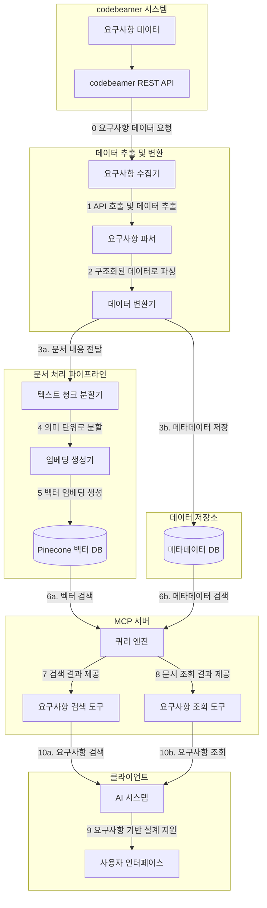
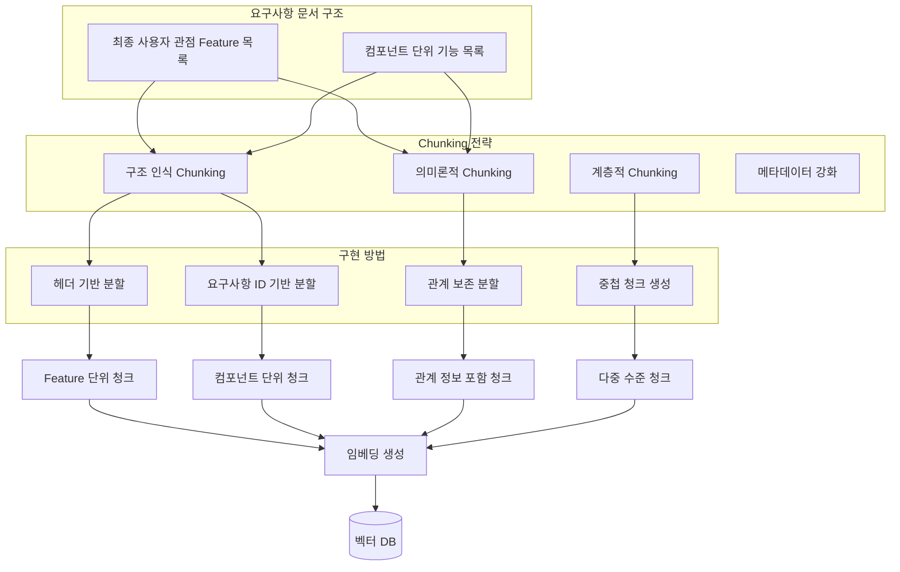
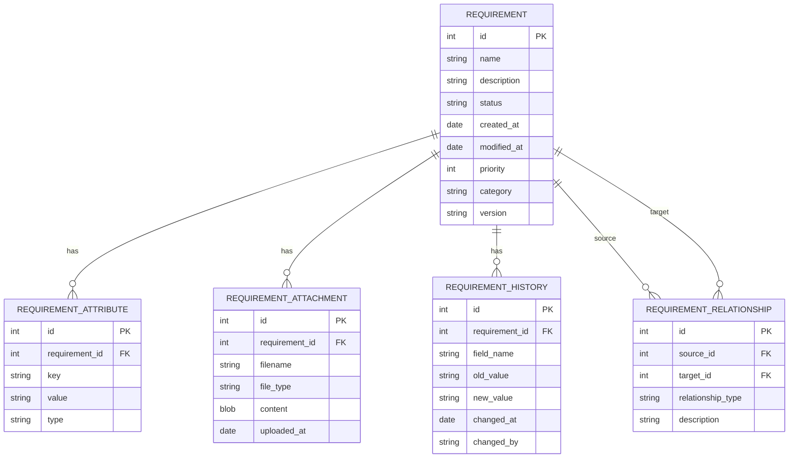
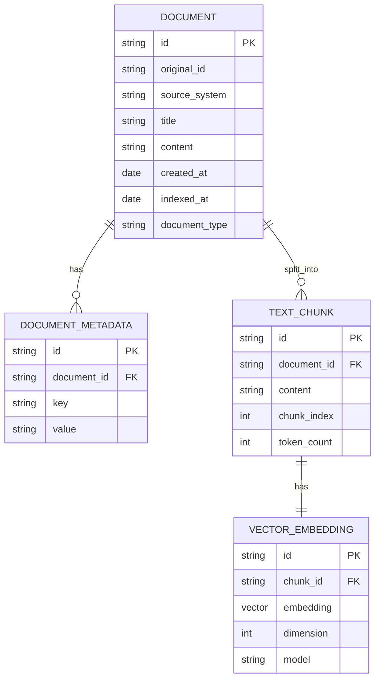
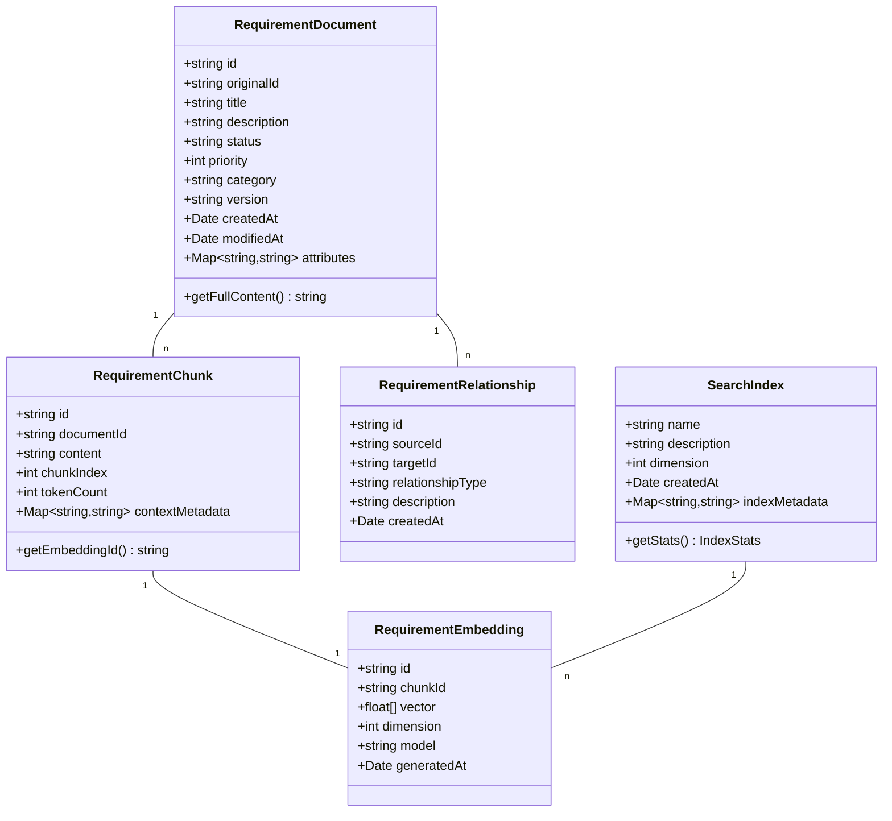

# 벡터 DB 기반 요구사항 문서 검색 시스템 설계

## 1. 개요

본 문서는 자동차용 인포테인먼트 시스템 개발 프로젝트에서 기존 요구사항 문서를 벡터 DB 기반으로 검색할 수 있는 MCP 서버 구축에 대한 설계를 다룹니다. 이 시스템은 AI 기반 요구사항 분석 및 설계 지원 시스템의 기반이 되며, 개발자와 설계자가 기존 문서를 효과적으로 검색하고 활용할 수 있도록 지원합니다.

## 2. 요구사항 문서 특성 분석

### 2.1 요구사항 문서 구조

인포테인먼트 시스템의 요구사항 문서는 크게 두 가지 관점으로 구성됩니다:

1. **최종 사용자 관점의 Feature 목록**
   - 사용자가 시스템을 통해 수행할 수 있는 기능 정의
   - 사용자 경험 및 인터페이스 요구사항 포함
   - 예: "사용자는 내비게이션 시스템을 통해 목적지까지의 최적 경로를 안내받을 수 있다."

2. **컴포넌트 단위의 기능 목록**
   - 시스템 내부 구현 관점의 기능 정의
   - 컴포넌트 간 인터페이스 및 의존성 정의
   - 예: "경로 계산 모듈은 GPS 데이터를 처리하고 최적 경로 알고리즘을 실행한다."

### 2.2 요구사항 문서 특성

- **구조화된 형식**: codebeamer에 저장된 요구사항은 ID, 제목, 설명, 상태 등의 필드를 가진 구조화된 형식
- **계층적 구조**: 상위 요구사항과 하위 요구사항 간의 계층 구조 존재
- **관계 정보**: 요구사항 간의 의존성, 파생 관계, 검증 관계 등 다양한 관계 정보 포함
- **이력 관리**: 요구사항의 변경 이력 및 버전 관리 정보 포함
- **속성 정보**: 우선순위, 담당자, 상태, 카테고리 등 다양한 메타데이터 포함

## 3. 시스템 아키텍처

### 3.1 전체 시스템 구조



### 3.2 주요 컴포넌트

#### 3.2.1 데이터 추출 및 변환 (ETL)

- **요구사항 수집기**: codebeamer API를 통해 요구사항 데이터 수집
- **요구사항 파서**: 수집된 데이터를 구조화된 형태로 파싱
- **데이터 변환기**: 파싱된 데이터를 문서 처리 파이프라인에 적합한 형태로 변환

#### 3.2.2 문서 처리 파이프라인

- **텍스트 청크 분할기**: 요구사항 문서를 의미 있는 단위로 분할
- **임베딩 생성기**: 각 청크에 대한 벡터 임베딩 생성

#### 3.2.3 데이터 저장소

- **Pinecone 벡터 DB**: 임베딩 벡터 저장 및 유사도 검색
- **메타데이터 DB**: 요구사항 메타데이터 저장 및 관리

#### 3.2.4 MCP 서버

- **쿼리 엔진**: 사용자 쿼리를 벡터 검색과 메타데이터 필터링으로 처리
- **요구사항 검색 도구**: MCP 프로토콜 기반 요구사항 검색 기능 제공
- **요구사항 조회 도구**: MCP 프로토콜 기반 요구사항 조회 기능 제공

## 4. 요구사항 문서 Chunking 전략

### 4.1 Chunking 접근 방식

요구사항 문서의 특성을 고려한 효과적인 chunking 전략이 필요합니다:



### 4.2 구조 인식 Chunking

요구사항 문서의 구조적 특성을 고려한 chunking:

- **Feature 단위 청크**: 최종 사용자 관점의 feature 단위로 청크를 생성
  ```
  Feature: 내비게이션 경로 안내
  설명: 사용자는 목적지까지의 최적 경로를 안내받을 수 있다.
  우선순위: 높음
  관련 요구사항: REQ-NAV-001, REQ-NAV-002, REQ-UI-015
  ```

- **컴포넌트 단위 청크**: 시스템 컴포넌트 단위로 청크를 생성
  ```
  컴포넌트: 경로 계산 모듈
  기능: GPS 데이터 처리, 최적 경로 알고리즘 실행, 교통 정보 통합
  인터페이스: IRouteCalculator, ITrafficInfoConsumer
  관련 요구사항: REQ-NAV-001, REQ-NAV-003, REQ-PERF-002
  ```

### 4.3 의미론적 Chunking

요구사항의 의미적 완전성을 보존하는 chunking:

- **요구사항 ID 기반 분할**: 각 요구사항 ID를 기준으로 분할하여 하나의 요구사항이 여러 청크로 나뉘지 않도록 함
- **관계 보존 분할**: 요구사항 간의 관계 정보(의존성, 상속 관계 등)를 청크 내에 포함시켜 컨텍스트를 유지

### 4.4 계층적 Chunking

요구사항의 계층 구조를 반영한 다중 수준의 chunking:

- **상위 수준 청크**: 전체 feature나 컴포넌트 수준의 개요 정보를 담은 청크
- **중간 수준 청크**: 관련 요구사항 그룹을 포함하는 청크
- **하위 수준 청크**: 개별 요구사항 상세 정보를 담은 청크

### 4.5 메타데이터 강화

각 청크에 풍부한 메타데이터를 추가하여 검색 정확도를 높임:

```json
{
  "chunk_id": "chunk-req-nav-001",
  "document_id": "doc-navigation-requirements",
  "requirement_id": "REQ-NAV-001",
  "requirement_type": "functional",
  "perspective": "user",
  "component": "navigation",
  "feature": "route_guidance",
  "priority": "high",
  "status": "approved",
  "related_requirements": ["REQ-NAV-002", "REQ-UI-015"],
  "parent_feature": "navigation_system",
  "content": "시스템은 사용자에게 현재 위치에서 목적지까지의 최적 경로를 제공해야 한다..."
}
```

## 5. 데이터 모델

### 5.1 요구사항 문서 데이터 모델



### 5.2 벡터 DB 데이터 모델



### 5.3 객체 모델



## 6. MCP 서버 API 설계

### 6.1 문서 검색 도구 API

- **엔드포인트**: `/api/tools/requirement_search`
- **메서드**: POST
- **요청 본문**:
  ```json
  {
    "query": "인포테인먼트 시스템 요구사항",
    "filters": {
      "documentType": "requirement",
      "perspective": "user",
      "priority": "high",
      "status": "approved"
    },
    "limit": 10
  }
  ```
- **응답**:
  ```json
  {
    "results": [
      {
        "documentId": "doc123",
        "chunkId": "chunk456",
        "score": 0.92,
        "content": "인포테인먼트 시스템은 다음과 같은 요구사항을 충족해야 한다...",
        "metadata": {
          "requirementId": "REQ-NAV-001",
          "title": "내비게이션 경로 안내",
          "priority": "high",
          "status": "approved",
          "component": "navigation",
          "feature": "route_guidance"
        }
      },
      // 추가 결과...
    ]
  }
  ```

### 6.2 문서 조회 도구 API

- **엔드포인트**: `/api/tools/requirement_retrieval`
- **메서드**: POST
- **요청 본문**:
  ```json
  {
    "requirementId": "REQ-NAV-001",
    "includeRelated": true,
    "format": "markdown"
  }
  ```
- **응답**:
  ```json
  {
    "requirement": {
      "id": "REQ-NAV-001",
      "title": "내비게이션 경로 안내",
      "description": "시스템은 사용자에게 현재 위치에서 목적지까지의 최적 경로를 제공해야 한다...",
      "metadata": {
        "priority": "high",
        "status": "approved",
        "component": "navigation",
        "feature": "route_guidance",
        "createdAt": "2024-01-15T09:30:00Z",
        "updatedAt": "2024-03-20T14:45:00Z"
      },
      "relatedRequirements": [
        {
          "id": "REQ-NAV-002",
          "title": "실시간 교통 정보 반영",
          "relationshipType": "depends_on"
        },
        {
          "id": "REQ-UI-015",
          "title": "경로 안내 화면 UI",
          "relationshipType": "implemented_by"
        }
      ]
    }
  }
  ```

## 7. 검색 시나리오 및 사용 사례

### 7.1 사용자 관점 검색

- **쿼리**: "사용자가 내비게이션에서 할 수 있는 기능은?"
- **처리 방식**: Feature 단위 청크에서 우선적으로 검색
- **결과 예시**: 내비게이션 관련 사용자 기능 목록 (경로 안내, 목적지 검색, 즐겨찾기 등)

### 7.2 구현 관점 검색

- **쿼리**: "경로 계산 모듈의 인터페이스는?"
- **처리 방식**: 컴포넌트 단위 청크에서 우선적으로 검색
- **결과 예시**: 경로 계산 모듈의 인터페이스 정의 및 관련 컴포넌트 정보

### 7.3 추적성 검색

- **쿼리**: "REQ-NAV-001과 관련된 모든 컴포넌트는?"
- **처리 방식**: 메타데이터의 관계 정보를 활용한 검색
- **결과 예시**: REQ-NAV-001과 관련된 컴포넌트 목록 및 관계 정보

### 7.4 계층적 검색

- **쿼리**: "내비게이션 시스템의 전체 구조와 세부 요구사항은?"
- **처리 방식**: 다중 수준 청크를 활용한 계층적 검색
- **결과 예시**: 내비게이션 시스템의 개요부터 세부 요구사항까지 계층적으로 정리된 정보

## 8. 구현 로드맵

### 8.1 1단계: 기본 인프라 구축 (2주)
- Pinecone 계정 설정 및 인덱스 생성
- 기본 Node.js/TypeScript 프로젝트 설정
- 문서 처리 파이프라인 기본 구조 구현

### 8.2 2단계: 문서 처리 파이프라인 구현 (3주)
- codebeamer API 연동 및 요구사항 수집기 구현
- 요구사항 파서 및 변환기 구현
- 요구사항 특화 청크 분할기 구현
- 임베딩 생성기 구현

### 8.3 3단계: 벡터 DB 연동 (2주)
- Pinecone 클라이언트 구현
- 메타데이터 저장소 구현
- 쿼리 프로세서 구현

### 8.4 4단계: MCP 서버 구현 (3주)
- API 게이트웨이 구현
- 요구사항 검색 도구 구현
- 요구사항 조회 도구 구현
- 쿼리 최적화 엔진 구현

### 8.5 5단계: 테스트 및 최적화 (2주)
- 단위 테스트 및 통합 테스트 작성
- 성능 테스트 및 최적화
- 문서화 및 배포 준비

## 9. 기술 스택

### 9.1 백엔드
- **언어**: TypeScript
- **런타임**: Node.js
- **프레임워크**: Express.js
- **벡터 DB**: Pinecone
- **메타데이터 DB**: MongoDB
- **문서 처리**: LangChain

### 9.2 임베딩 생성
- **모델**: OpenAI Ada 2
- **대안**: Sentence Transformers (로컬 배포 시)

### 9.3 MCP 서버
- **프로토콜**: Model Context Protocol
- **인증**: JWT 기반 인증
- **API**: RESTful API

### 9.4 배포
- **컨테이너화**: Docker
- **오케스트레이션**: Kubernetes (선택적)
- **CI/CD**: GitHub Actions

## 10. 기술적 고려사항

### 10.1 확장성
- 대량의 요구사항 처리를 위한 비동기 처리 및 큐 시스템 도입
- 수평적 확장을 위한 마이크로서비스 아키텍처 고려

### 10.2 보안
- 요구사항 접근 제어를 위한 세분화된 권한 관리
- API 키 및 토큰 관리 시스템 구현
- 데이터 암호화 (전송 중 및 저장 시)

### 10.3 성능
- 벡터 검색 성능 최적화를 위한 인덱스 튜닝
- 캐싱 전략 구현 (Redis 활용)
- 쿼리 최적화 및 결과 재정렬 알고리즘 개선

### 10.4 유지보수
- 요구사항 변경 감지 및 자동 업데이트 메커니즘
- 로깅 및 모니터링 시스템 구축
- 정기적인 임베딩 재생성 및 최적화 프로세스

## 11. 결론

벡터 DB 기반 요구사항 문서 검색 시스템은 인포테인먼트 시스템 개발 프로젝트에서 기존 요구사항 문서를 효과적으로 활용할 수 있는 기반을 제공합니다. 요구사항 문서의 특성을 고려한 chunking 전략과 메타데이터 활용을 통해 다양한 검색 시나리오를 지원하며, MCP 서버를 통해 AI 시스템과의 연동을 가능하게 합니다.

이 시스템은 개발자와 설계자가 기존 요구사항을 쉽게 검색하고 참조할 수 있게 함으로써, 새로운 요구사항 분석 및 설계 작업의 효율성과 일관성을 크게 향상시킬 것으로 기대됩니다.
