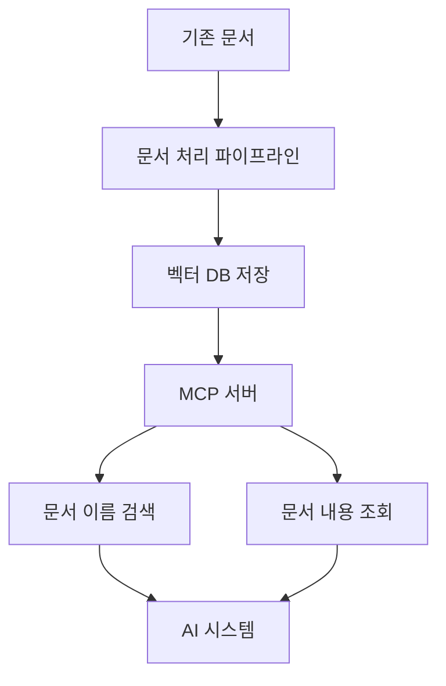
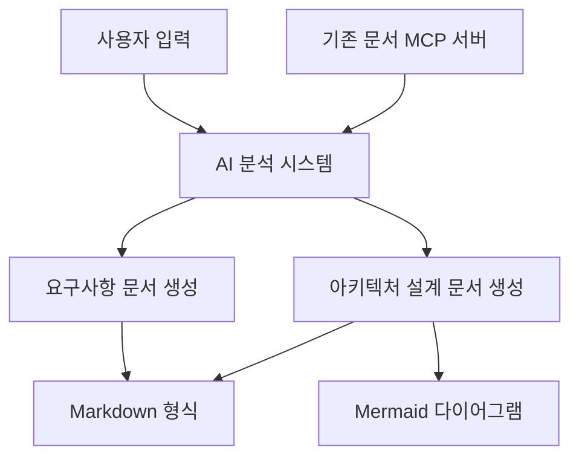

# 인포테인먼트 시스템 개발 프로젝트 개요

## 현재 상황
- 자동차용 인포테인먼트 시스템 개발 중 (리눅스 기반 임베디드 시스템)
- 기존 요구사항 명세서, 아키텍처 설계 문서, 함수 단위의 상세 설계 문서가 codebeamer, confluence 등에 존재

## 목표 시스템
1. 벡터 DB 기반 문서 검색 MCP 서버 구축
   - 기존 문서를 벡터 DB에 저장
   - AI 기반 검색 서비스 제공
   - MCP 서버를 통해 AI 시스템에서 필요한 문서 검색 및 조회

2. AI 기반 요구사항 분석 및 설계 지원 시스템
   - 새로운 소프트웨어 개발 시 요구사항과 설계를 Markdown과 Mermaid로 작성
   - AI의 도움을 받아 요구사항 분석 및 설계 문서 작성 지원
   - MCP 서버를 통해 기존 요구사항 및 설계 문서를 참조하여 새로운 시스템 설계 지원

## 시스템 아키텍처
### 벡터 DB 기반 문서 검색 MCP 서버

### AI 기반 요구사항 분석 및 설계 지원 시스템

## 기술 스택 고려사항
1. **벡터 DB**: Pinecone, Weaviate, Milvus 등
2. **문서 처리**: LangChain, LlamaIndex 등을 활용한 문서 처리 및 임베딩
3. **MCP 서버**: TypeScript/Node.js 기반 MCP 서버 구현
4. **AI 모델 연동**: OpenAI API 또는 로컬 LLM 활용
